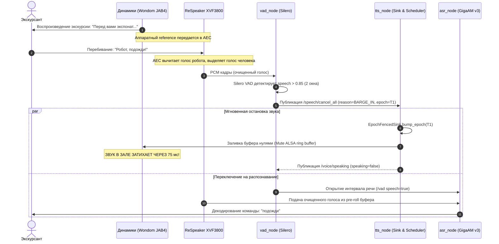
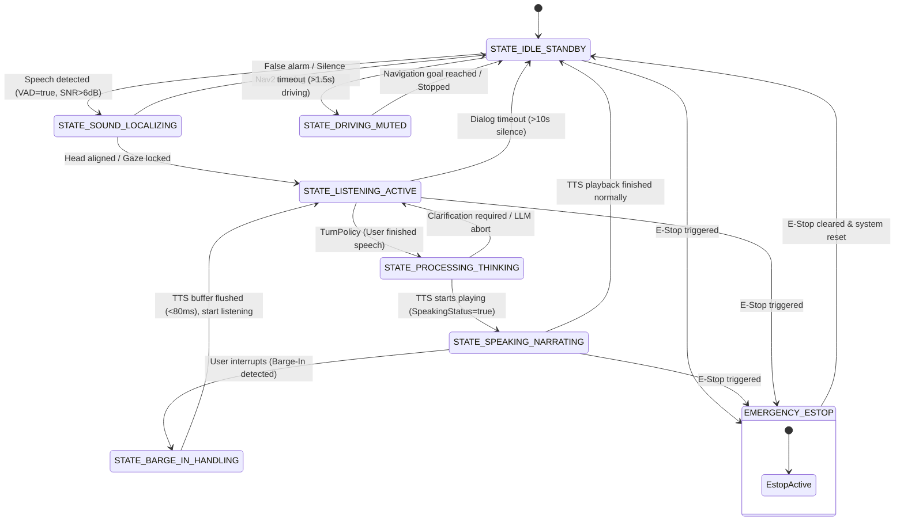

# Архитектура аудио-подсистемы робота-экскурсовода: Микрофонный массив, 4-канальное звукоусиление, AEC, Barge-In, локализация (DOA) и FSM

> **Статус документа**: Проектная спецификация (Engineering Architecture Document)
> **Целевая платформа**: ROS 2 Humble, Jetson Orin NX 16GB / x86_64, ОС Linux (Ubuntu 22.04)
> **Контекст репозитория**: Пакеты [`guide_robot_voice`](file:///home/sokovikov/Robo-guide/guide_robot_voice), [`guide_robot_msgs`](file:///home/sokovikov/Robo-guide/guide_robot_msgs), [`guide_robot_face`](file:///home/sokovikov/Robo-guide/guide_robot_face), [`guide_robot_description`](file:///home/sokovikov/Robo-guide/guide_robot_description).

---

## 1. Введение и постановка задачи

Робот-экскурсовод (**Robo-guide**) функционирует в жестких акустических условиях музейных и выставочных залов:
- **Высокая реверберация**: гладкие полы, каменные стены, витрины ($RT_{60} \ge 400\dots 800$ мс).
- **Собственные шумы робота (эго-шум)**: шум вращения вентиляторов Jetson/блока питания, трение колес, гул тяговых редукторов при движении.
- **Внешние акустические помехи**: шум толпы, параллельные экскурсии, детский крик, эхо шагов.
- **Пространственная неопределенность**: экскурсанты располагаются в секторе $360^\circ$ вокруг робота.

Для обеспечения естественного голосового взаимодействия робот должен:
1. **Не слышать самого себя**: полностью вычитать собственную речь (TTS) из микрофонного тракта, даже когда 4 мощных динамика работают на высокой громкости в непосредственной близости от микрофонов.
2. **Поддерживать мгновенный Barge-In**: человек должен иметь возможность перебить робота в любой момент речи; робот обязан замолчать за время $< 100$ мс и начать слушать вопрос.
3. **Локализовать говорящего (DOA) и поворачивать голову**: определять азимут источника звука, плавно ориентировать лицо и взгляд на экскурсанта, не вызывая дерганий и ложных разворотов от эха.
4. **Работать под управлением детерминированного конечного автомата (FSM)**: согласовывать захват, локализацию, отображение эмоций на дисплее лица, синтез речи и навигацию.

---

## 2. Аппаратная архитектура и подбор компонентов

### 2.1 Микрофонный массив: ReSpeaker XVF3800

В качестве ядра аудиозахвата выбран **ReSpeaker XVF3800** на базе чипа **XMOS xcore.ai VocalFusion XVF3800**.

#### Технические характеристики и преимущества:
- **Конфигурация**: круговой массив (circular array) диаметром 65 мм с 4 PDM MEMS-микрофонами (SNR $\approx 64$ дБ).
- **Встроенный аппаратный DSP-конвейер**:
  - **Acoustic Echo Cancellation (AEC)**: подавление эха до 50 дБ (ERLE) с адаптивной фильтрацией в поддиапазонах.
  - **Double-Talk Detector (DTD)**: мгновенная заморозка адаптации фильтра при появлении речи человека во время работы динамиков.
  - **Adaptive Beamforming**: формирование узкой диаграммы направленности на источник речи с управляемыми нулями (null-steering) в сторону помех.
  - **Direction of Arrival (DOA)**: расчет угла прихода звука $360^\circ$ с дискретностью $1^\circ$ и выдачей метрики уверенности (Beam SNR).
  - **Noise Suppression (NS)** & **Automatic Gain Control (AGC)**: выравнивание уровня сигнала от говорящего на дистанции от 0.5 до 5 метров.
- **Интерфейсы взаимодействия**:
  - **USB Audio Class 2.0 (UAC2)**: передача очищенного моно-канала речи, сырых микрофонных каналов и прием аппаратного опорного сигнала (Hardware Reference Loopback).
  - **USB HID / Control Interface**: чтение регистров реального времени (угол DOA, энергия лучей, VAD-флаги, статус DTD) без задержек.

```
                      ┌──────────────────────────────────────┐
                      │        ReSpeaker XVF3800             │
                      │                                      │
  4x MEMS Mic ───────►│ 4-канальный АЦП                      │
  (Акустика зала)     │           │                          │
                      │           ▼                          │
                      │ ┌──────────────────────────────────┐ │
                      │ │   Аппаратный DSP (xcore.ai):     │ │
                      │ │  • AEC (Acoustic Echo Canceller) │ │
                      │ │  • Beamformer (MVDR/GSC)         │ │
                      │ │  • DOA Engine (360° Tracking)    │ │
                      │ │  • Noise Suppressor / AGC        │ │
                      │ └─────────────────┬────────────────┘ │
                      │                   │                  │
                      │       ┌───────────┴───────────┐      │
                      │       ▼                       ▼      │
                      │ Processed PCM            DOA Angle   │
                      │ (Endpoint 1)             (HID Int)   │
                      └───────┬───────────────────────┬──────┘
                              │                       │
           USB UAC2 Audio In  │                       │ USB HID (Telemetry)
                              ▼                       ▼
                      ┌──────────────────────────────────────┐
                      │    Бортовой компьютер (Jetson Orin)  │
                      └──────────────────────────────────────┘
```

---

### 2.2 Подбор усилителя мощности для 4 колонок

#### Требования к усилителю:
1. **4 независимых канала вывода**: для равномерного покрытия $360^\circ$ в зале без «мертвых зон» и без необходимости выкручивать громкость одного динамика до оглушающего уровня.
2. **Питание от бортовой сети робота**: постоянный ток 12 В или 24 В (аккумулятор LiFePO4/Li-ion).
3. **Класс D с высоким КПД (>90%)**: отсутствие активных вентиляторов охлаждения (кулеры усилителя создавали бы постоянный шум для микрофона).
4. **Сверхнизкий уровень нелинейных искажений (THD+N < 0.05%)**: критично для работы AEC. Любые нелинейные искажения усилителя (клиппинг, гармоники) не могут быть удалены линейным адаптивным фильтром эхоподавления.
5. **Аппаратная поддержка опорного сигнала (Reference Loopback)**.

#### Сравнительный анализ кандидатов:

| Модель усилителя | Архитектура / Чип | Каналы и мощность | Напряжение питания | Наличие DSP / Loopback | Оценка и вердикт |
|---|---|---|---|---|---|
| **Wondom (Sure) JAB4** *(Рекомендуемый)* | Class-D, 2× TPA3116D2 + DSP ADAU1701 | **4 × 30 Вт** (8 Ом) или **4 × 50 Вт** (4 Ом) | 10–26 В DC (номинал 24 В) | **Встроенный SigmaDSP ADAU1701**: поканальный EQ, лимитеры, задержки | **Победитель**: промышленный класс, встроенный DSP защищает динамики от перегрузки (THD < 0.03%), идеален для 360° аудиопокрытия |
| **Dayton Audio KAB-4100v2** | Class-D, TPA3116 | 4 × 100 Вт (4 Ом при 24 В) | 12–24 В DC | Опциональный модуль DSPB-K | Отличный выбор, но более габаритный и дорогой |
| **Плата TPA3116D2 4-Channel Red** | Class-D, 2× TPA3116D2 (Китай) | 4 × 50 Вт (4 Ом) | 12–24 В DC | Нет DSP, аналоговые потенциометры | Бюджетный вариант ($15), требует внешней платы защиты и изолятора земли |
| **TAS5825M Quad Evaluation Board** | Pure Digital Class-D | 4 × 30 Вт | 12–24 В DC | I2S цифровой вход, встроенный DSP | Отличные параметры, но сложная разводка шины I2S от Jetson |

#### Финальный выбор: **Wondom JAB4 (Sure Electronics AA-JA33285)**
- **Мощность**: 4 канала по 30–50 Вт. На роботе-экскурсоводе рабочая средняя мощность составляет 5–10 Вт на канал (суммарно 20–40 Вт акустической мощности), что обеспечивает уровень звукового давления $85\dots 88$ дБ на расстоянии 2 метров без малейшего намека на клиппинг.
- **Встроенный DSP ADAU1701**: через ПО Analog Devices SigmaStudio настраиваются:
  1. **High-Pass Filter (HPF 100 Гц, Butterworth 24 дБ/окт)**: срезает низкочастотный гул и предотвращает механический перегруз диффузоров.
  2. **Поканальный Peak Limiter (Brickwall)**: жестко ограничивает амплитуду на уровне -1.5 dBFS. Усилитель гарантированно не входит в нелинейный клиппинг, благодаря чему AEC на ReSpeaker XVF3800 работает в своей оптимальной линейной зоне.
  3. **Delay Line (компенсация задержки)**: возможность выравнивания фаз между передними и задними динамиками.

---

### 2.3 Акустические излучатели (4 колонки) и диаграмма направленности

#### Выбор динамиков:
Рекомендуются 4 широкополосных динамика **Dayton Audio DMA80-4** (3 дюйма, 4 Ом, 30 Вт RMS) или **Visaton FRS 8 M / 8 Ohm**:
- Алюминиевый диффузор с резиновым подвесом обеспечивает отличную разборчивость человеческой речи ($100\dots 18000$ Гц).
- Неодимовая магнитная система экранирована и имеет минимальный вес (важно для балансировки корпуса робота).

#### Размещение и акустическое оформление:
- **Расположение**: 4 динамика монтируются в средней/нижней части торса робота с шагом $90^\circ$ (Front, Right, Rear, Left) либо по диагоналям под углом $45^\circ$ к продольной оси.
- **Акустический объем**: каждый динамик помещается в **герметичный изолированный бокс (Sealed Enclosure)** объемом $0.8\dots 1.2$ литра, заполненный демпфирующим материалом (акустический синтепон).
- **Критическое правило**: динамики ни в коем случае не должны работать в общий внутренний объем головы/шасси робота, иначе тыльная волна вызовет вибрацию корпуса, которая проникнет прямо в микрофоны через структуру робота!

---

### 2.4 Схема электрических и сигнальных соединений

```
                      +24V Battery Bus (PDB робота)
                                  │
                  ┌───────────────┴───────────────┐
                  ▼                               ▼
       ┌─────────────────────┐         ┌─────────────────────┐
       │ Isolated DC-DC 12V  │         │ DC-DC Filter /      │
       │ (Питание логики)    │         │ LC-фильтр питания   │
       └──────────┬──────────┘         └──────────┬──────────┘
                  │                               │ +24V DC
                  ▼                               ▼
          Jetson Orin NX                 Wondom JAB4 (4-Ch Amp)
        ┌────────────────┐             ┌─────────────────────────┐
        │                │             │  [CH1 Out] ──► Front Spk│
        │                │             │  [CH2 Out] ──► Right Spk│
        │                │             │  [CH3 Out] ──► Rear Spk │
        │                │             │  [CH4 Out] ──► Left Spk │
        │                │             │                         │
        │   USB 2.0 Port │             │                         │
        └───┬────────────┘             └────────────▲────────────┘
            │                                       │
            │ UAC2 Audio Stream + Control           │ 4-Ch Line Input
            │ (Audio In + Loopback Out)             │
            ▼                                       │
      ┌────────────────────────────────┐            │
      │    ReSpeaker XVF3800 Board     │            │
      │                                │            │
      │ • Mic Capture (4x MEMS)        │            │
      │ • XMOS AEC DSP (xcore.ai)      │            │
      │ • DAC Output                   │            │
      └──────────────┬─────────────────┘            │
                     │ 3.5mm Stereo Line-Out        │
                     ▼                              │
      ┌────────────────────────────────┐            │
      │ Ground Loop Isolator (Трансф.) ├────────────┘
      │ (Устранение земляных петель)   │ (Разветвитель на 4 канала)
      └────────────────────────────────┘
```

#### Ключевой нюанс: Организация аппаратного Reference Loopback (AEC Ref)
Для безупречной работы AEC алгоритм должен получать **точную, синхронную по тактовой частоте копию сигнала**, который подается на усилитель.
В данной схеме это достигается аппаратно:
1. Нода `tts_node` воспроизводит звук в ALSA-устройство `hw:CARD=ReSpeaker,DEV=0`.
2. Аудиопоток передается по USB на чип XMOS XVF3800.
3. Внутри прошивки XMOS цифровой PCM-поток **раздваивается**:
   - Первая копия идет на внутренний ЦАП (DAC) и через разъем 3.5 мм поступает на усилитель Wondom JAB4 и динамики.
   - Вторая копия **внутри чипа** поступает напрямую в блок AEC как опорный сигнал (`Reference Signal`) с нулевой задержкой и нулевым джиттером!
4. **Результат**: полностью исключается рассинхронизация по времени, которая неизбежно убивает программный AEC при использовании раздельных звуковых карт для микрофона и динамиков.

---

## 3. Подавление самослышания («Робот не слышит самого себя»)

Проблема самовозбуждения и самослышания решается на **трех эшелонах обороны**:

```
 ┌────────────────────────────────────────────────────────────────────────┐
 │ 1. АППАРАТНО-МЕХАНИЧЕСКАЯ ИЗОЛЯЦИЯ                                     │
 │    • Силиконовые демпферы M3 под платой микрофонов (развязка от шасси) │
 │    • Герметичные боксы динамиков (нет утечки звука внутри корпуса)     │
 │    • Акустический козырек (baffle): динамики направлены вниз и вбок    │
 └───────────────────────────────────┬────────────────────────────────────┘
                                     │ Затухание механического пути > 20 dB
                                     ▼
 ┌────────────────────────────────────────────────────────────────────────┐
 │ 2. АППАРАТНЫЙ DSP AEC (XMOS XVF3800)                                   │
 │    • Субполосный адаптивный фильтр NLMS/MDF (моделирование эхо-пути)   │
 │    • Double-Talk Detector (DTD): заморозка весов при встречной речи    │
 │    • Non-Linear Processor (NLP): подавление остаточного хвоста эха     │
 └───────────────────────────────────┬────────────────────────────────────┘
                                     │ ERLE > 35...45 dB
                                     ▼
 ┌────────────────────────────────────────────────────────────────────────┐
 │ 3. ПРОГРАММНЫЙ УРОВЕНЬ ROS 2                                           │
 │    • Gating по /voice/speaking (SpeakingStatus.msg)                    │
 │    • Динамический подъем порога Silero VAD (0.65 -> 0.85 при TTS)      │
 │    • DeepFilterNet3 (нейросетевое удаление остаточных артефактов)      │
 │    • Семантический фильтр эха (отбрасывание совпадений с фразой TTS)   │
 └────────────────────────────────────────────────────────────────────────┘
```

### 3.1 Механическая и акустическая изоляция
- **Виброразвязка микрофонного массива**: плата ReSpeaker крепится к оголовку робота через силиконовые вибродемпферы твердостью 30–40 Shore A. Без демпферов вибрация корпуса от басов динамиков распространяется по алюминиевой раме со скоростью звука в металле (~5000 м/с) и попадает на кристаллы MEMS-микрофонов раньше, чем воздушная волна, нарушая причинно-следственную связь адаптивного фильтра.
- **Геометрия направленности**: микрофонный массив расположен в наивысшей точке робота (макушка головы) и закрыт снизу акустическим отражающим фланцем (экраном). Динамики располагаются на 40–60 см ниже и направлены в стороны/вниз.

### 3.2 Математика и алгоритм адаптивного AEC на чипе XMOS
Сигнал на входе микрофона $y(t)$:
$$y(t) = s(t) + \sum_{\tau=0}^{L-1} h(\tau) \cdot d(t - \tau) + n(t)$$
где:
- $s(t)$ — полезный голос человека;
- $d(t)$ — опорный сигнал (речь робота из dynamic reference loopback);
- $h(\tau)$ — импульсная характеристика прямого акустического тракта («динамик $\to$ зал $\to$ микрофон»);
- $n(t)$ — фоновый шум помещения и моторов.

Адаптивный фильтр чипа строит оценку $\hat{h}(\tau)$ с помощью нормализованного метода наименьших квадратов в частотной области (PBFDAF — Partitioned Block Frequency Domain Adaptive Filter):
$$e(t) = y(t) - \hat{y}(t) = y(t) - \sum_{\tau=0}^{L-1} \hat{h}(\tau) \cdot d(t - \tau)$$

#### Double-Talk Detection (DTD):
Если человек начинает говорить во время речи робота ($s(t) \ne 0$), сигнал ошибки $e(t)$ резко возрастает. Обычный адаптивный фильтр ошибочно принимает голос человека за ошибку прогнозирования эха и начинает «подстраиваться» под него, разрушая накопленные коэффициенты $\hat{h}(\tau)$ и искажая голос человека.
Встроенный DTD чипа вычисляет кросс-корреляцию между $y(t)$ и $d(t)$. При обнаружении встречной речи адаптация **немедленно блокируется** ($\mu = 0$), а текущие коэффициенты фильтра замораживаются.

### 3.3 Программная защита в ROS 2
Если в реверберирующем зале с $RT_{60} = 600$ мс остаточный отголосок эха все же прорывается через линейный фильтр:
1. **Dynamic VAD Threshold**: нода `vad_node` подписана на `/voice/speaking` ([`SpeakingStatus.msg`](file:///home/sokovikov/Robo-guide/guide_robot_msgs/msg/SpeakingStatus.msg)). В момент, когда `speaking == true`, порог активации речи `enter_threshold` динамически поднимается с **0.65** до **0.85**, а минимальное число подтверждающих окон `barge_in_min_windows` удерживается равным 2. Это исключает случайные срабатывания от тихого остаточного эха.
2. **Self-Echo Text Filter**: если ASR декодирует фразу, нода сравнивает ее с текущим синтезируемым предложением `tts_node`. Если дистанция Левенштейна $< 0.25 \times \text{len}(\text{phrase})$, гипотеза отбрасывается как эховое проникновение.

---

## 4. Архитектура Barge-In (Мгновенное прерывание речи)

### 4.1 Бюджет задержек (Latency Budget)
Целевой показатель: робот должен полностью прекратить воспроизведение звука в динамиках менее чем через **80 мс** после того, как человек произнес первый слог перебивания.

| Этап конвейера | Время выполнения | Описание процесса |
|---|---|---|
| **1. Захват и буферизация звука** | **16.0 мс** | Накопление аудио-фрейма (256 сэмплов @ 16 кГц) в драйвере |
| **2. Аппаратный DSP (XVF3800)** | **12.0 мс** | Фильтрация AEC, работа DTD, формирование луча Beamformer |
| **3. Передача по USB в Jetson** | **1.5 мс** | Передача изохронного пакета USB UAC2 в ядро Linux / ALSA |
| **4. Инференс Silero VAD (ONNX)** | **3.5 мс** | Инференс модели Silero VAD v5 на CPU Jetson Orin NX |
| **5. Проверка гистерезиса (2 окна)** | **32.0 мс** | Подтверждение стабильности речи (`barge_in_min_windows = 2`) |
| **6. Публикация ROS 2 топика** | **0.5 мс** | Публикация `/speech/cancel_all` (`CancelAll.msg`, intra-process/IPC) |
| **7. Очистка буфера sink в `tts_node`** | **10.0 мс** | Мгновенный сброс кольцевого буфера PortAudio (`bump epoch` + flush) |
| **ИТОГО (Полная задержка Barge-In)** | **~75.5 мс** | **Человек воспринимает реакцию как мгновенную и естественную** |

### 4.2 Алгоритм и механизм Epoch Fencing
В [`guide_robot_voice`](file:///home/sokovikov/Robo-guide/guide_robot_voice) реализован механизм **Epoch Fencing**:



#### Защита от ложных прерываний:
- **Поле `interruptible` в [`SpeakingStatus.msg`](file:///home/sokovikov/Robo-guide/guide_robot_msgs/msg/SpeakingStatus.msg)**: если робот произносит критически важное предупреждение о безопасности (например, при риске столкновения), флаг `interruptible=false`. Нода `vad_node` блокирует автоматический barge-in. Только стоп-слово через `wakeword_node` или физический E-Stop могут прервать речь в этом режиме.
- **Рефрактерный период**: после срабатывания barge-in на 500 мс активируется защитный интервал, чтобы остаточные звуки затухания динамиков не порождали повторных ложных сигналов отмены.

---

## 5. Локализация источника звука (DOA) и управление поворотом головы

### 5.1 Алгоритм локализации на ReSpeaker XVF3800
Чип использует алгоритм **Steered Response Power with Phase Transform (SRP-PHAT)** между парами микрофонов:
1. Вычисляются взаимные обобщенные корреляционные функции (GCC-PHAT) для 6 микрофонных пар массива:
   $$R_{ij}(\tau) = \int_{-\infty}^{\infty} \frac{X_i(f) X_j^*(f)}{|X_i(f) X_j^*(f)|} e^{j 2 \pi f \tau} df$$
2. Аппаратный блок вычисляет азимут $\theta \in [-\pi, +\pi]$, соответствующий максимуму пространственной энергии.
3. В регистр телеметрии записываются:
   - `azimuth` — угол в радианах ($0 = \text{вперед}$, $+\pi/2 = \text{влево}$, $-\pi/2 = \text{вправо}$);
   - `beam_snr_db` — отношение энергии выбранного сектора к средней энергии окружения (мера достоверности).

### 5.2 Фильтрация ложных отражений (De-fluttering Pipeline)
Сырые показания DOA в гулком помещении могут хаотично прыгать из-за реверберации от стеклянных витрин. В разработанной ноде `head_sound_tracker_node` внедрен 4-ступенчатый конвейер фильтрации:

```
  Сырой угол DOA от XVF3800 ──► [1. VAD & SNR Gate]
                                       │ (Пропуск только при речи и SNR > 6 dB)
                                       ▼
                                [2. Angular Deadband (±10°)]
                                       │ (Подавление микро-колебаний)
                                       ▼
                                [3. 1D Circular Kalman Filter]
                                       │ (Сглаживание траектории)
                                       ▼
                                [4. Self-Motion / TTS Lockout]
                                       │ (Запрет поворота при собственной речи)
                                       ▼
                                Целевой угол на сервопривод шеи и дисплей лица
```

1. **VAD & SNR Gate**: угол принимается во внимание **только тогда**, когда `VoiceActivity.speech_detected == true` и `beam_snr_db > 6.0` дБ. Во время тишины, хлопков или шума шагов угол игнорируется.
2. **Angular Deadband (Зона нечувствительности $\pm 10^\circ$)**: если новый расчетный угол отличается от текущего положения головы менее чем на $10^\circ$, команда на поворот не выдается. Это устраняет «нервное подергивание» головы робота.
3. **1D Circular Kalman Filter**: фильтр Калмана с учетом круговой периодичности $[-\pi, +\pi]$ отслеживает истинное положение говорящего человека, сглаживая шум измерений.
4. **Self-Motion & TTS Lockout**: в момент, когда робот сам говорит (`speaking == true`), ориентация головы фиксируется на последнем собеседнике. Запрещается поворот на отражения собственного голоса от стен!

### 5.3 Трехуровневая кинематическая реакция

Робот распределяет реакцию по трем исполнительным механизмам в зависимости от угла и скорости:

```
                ┌──────────────────────────────────────────────────────────┐
                │             Отфильтрованный азимут DOA θ                 │
                └────────────────────────────┬─────────────────────────────┘
                                             │
               ┌─────────────────────────────┼─────────────────────────────┐
               ▼                             ▼                             ▼
    |θ| <= 25° (Малый угол)        25° < |θ| <= 75° (Средний)      |θ| > 75° (Человек сзади)
 ┌───────────────────────────┐ ┌───────────────────────────┐ ┌───────────────────────────┐
 │ Только взгляд на экране   │ │ Взгляд + Поворот шеи      │ │ Взгляд + Шея + Разворот   │
 │ (guide_robot_face)        │ │ (head_yaw_joint)          │ │ базы робота на колесах    │
 │ • Задержка < 50 мс        │ │ • Трапецеидальный профиль │ │ • Команда cmd_vel в Nav2  │
 │ • Мгновенный контакт глаз │ │ • Скорость 60°/с          │ │ • Разворот робота лицом   │
 └───────────────────────────┘ └───────────────────────────┘ └───────────────────────────┘
```

1. **Уровень 1: Виртуальный взгляд (`guide_robot_face`)**:
   - Топик `/face/state` ([`FaceState.msg`](file:///home/sokovikov/Robo-guide/guide_robot_msgs/msg/FaceState.msg)): параметр `gaze_az` изменяется в диапазоне $-90^\circ\dots +90^\circ$.
   - Зрачки на дисплее робота переводятся на говорящего за 40–60 мс (саккадическое движение). Человек мгновенно видит, что робот обратил на него внимание, еще до того, как тяжелая шея закончит физический поворот!
2. **Уровень 2: Сервопривод шеи (`head_yaw_joint`)**:
   - Плавный поворот шеи со скоростью $\omega \le 60^\circ/\text{с}$ и ограничением ускорения $a \le 120^\circ/\text{с}^2$.
   - Плавность критически важна: резкие движения пугают посетителей музея и создают аэродинамический и механический шум в микрофонах.
3. **Уровень 3: Разворот шасси (`diff_drive_controller`)**:
   - Если собеседник находится сзади ($|\theta| > 75^\circ$), диапазона шеи недостаточно.
   - Нода отправляет команду разворота на месте через `cmd_vel` в стек навигации, разворачивая корпус робота лицом к человеку.

---

## 6. Конечный автомат (FSM) голосового взаимодействия

### 6.1 Архитектурная диаграмма состояний (State Diagram)



---

### 6.2 Матрица состояний компонентов подсистемы

В каждом состоянии FSM все 7 аппаратных и программных блоков переводятся в строго определенный режим работы:

| Состояние FSM | ReSpeaker XVF3800 (AEC & DSP) | Silero VAD (`vad_node`) | ASR Recognizer (`asr_node`) | TTS Audio Sink (`tts_node`) | Сервопривод шеи (`head_yaw`) | Дисплей лица (`face_node`) | Усилитель Wondom JAB4 |
|---|---|---|---|---|---|---|---|
| **`IDLE_STANDBY`** | Мониторинг $360^\circ$, AEC адаптируется к фону зала | Порог 0.65, ожидание активации | В режиме pre-roll кольцевого буфера | Молчит (`speaking=false`) | В нейтрали ($0^\circ$), редкие саккады осмотра | `state: "idle"`, зрачки по центру | Включен, фоновый шум заглушен |
| **`SOUND_LOCALIZING`** | Фиксация луча на источнике звука, расчет азимута $\theta$ | Активен, фильтрует короткие всплески (<120 мс) | Копит pre-roll аудио | Молчит | Плавное наведение на угол $\theta$ | `state: "curious"`, зрачки на $\theta$ | Включен |
| **`LISTENING_ACTIVE`** | Beamformer зафиксирован на человеке, максимальное NS | Порог 0.65, отслеживание пауз (`TurnPolicy`) | Активный стриминг партиалов `/asr/partial` | Молчит | Удержание взгляда на собеседнике | `state: "listening"`, контакт глаз | Включен |
| **`PROCESSING_THINKING`** | Поддержание акустического контакта | Ожидание | Финализация `/asr/transcript`, инференс LLM | Подготовка аудиоквантов синтеза | Удержание взгляда с легким наклоном | `state: "thinking"`, зрачки вверх-вбок | Включен |
| **`SPEAKING_NARRATING`** | **AEC в максимальном режиме**, DTD активен, Reference Loopback | **Режим Barge-In**: порог поднят до **0.85**, `min_windows=2` | Остановлен либо распознает только стоп-слова | **Воспроизведение через 4 колонки** | **Заблокирован!** Запрет поворота на эхо | `state: "speaking"`, анимация речи | **Активное воспроизведение** |
| **`BARGE_IN_HANDLING`** | DTD замораживает коэффициенты эхо-фильтра | Зафиксировал факт перебивания | Мгновенный сброс буфера, захват нового голоса | **Мгновенный сброс буфера (`bump epoch`)** | Наведение на источник перебивания | `state: "surprised"` $\to$ `"listening"` | Сброс PCM в ноль за <10 мс |
| **`DRIVING_MUTED`** | Подавление шума редукторов и моторов | Загрублен (порог 0.85), подавление эго-шума | Отключен (кроме аварийного "стой") | Оповещения движения (приоритет NAV) | Смотрит по ходу движения робота | `state: "driving"`, взгляд вперед | Воспроизведение предупреждений |
| **`EMERGENCY_ESTOP`** | Mute | Остановлен | Остановлен | Экстренный сброс всех звуков | Обесточен / фиксация | `state: "error"`, мигание | Mute |

---

### 6.3 Детальная таблица переходов состояний (State Transition Table)

| # | Исходное состояние | Событие / Триггер | Guard Condition (Условие проверки) | Выполняемое действие (Action) | Следующее состояние |
|---|---|---|---|---|---|
| 1 | `IDLE_STANDBY` | `VoiceActivity.speech == true` | `Doa.beam_snr_db >= 6.0` и `confidence >= 0.7` | Запуск таймера локализации, расчет целевого угла $\theta$ | `SOUND_LOCALIZING` |
| 2 | `IDLE_STANDBY` | Старт навигации к экспонату | `MissionState == NAVIGATING` | Перевод лица в `"driving"`, загрубление VAD | `DRIVING_MUTED` |
| 3 | `SOUND_LOCALIZING` | Ошибка $\Delta\theta < 5^\circ$ (наведение завершено) | Человек продолжает говорить (`speech == true`) | Публикация `/face/state (listening)`, старт ASR | `LISTENING_ACTIVE` |
| 4 | `SOUND_LOCALIZING` | Таймаут тишины ($t > 1.5$ с) | Речь прекратилась, ложная тревога | Возврат головы в нейтраль $0^\circ$ | `IDLE_STANDBY` |
| 5 | `LISTENING_ACTIVE` | Срабатывание `TurnPolicy` (пауза $\ge 600$ мс) | Длина фразы $\ge 2$ символов | Финализация `/asr/transcript`, отправка в диалог | `PROCESSING_THINKING` |
| 6 | `LISTENING_ACTIVE` | Таймаут отсутствия речи ($t > 10$ с) | Ни одного слова не распознано | Сброс ASR, прощание / возврат в ожидание | `IDLE_STANDBY` |
| 7 | `PROCESSING_THINKING` | Готов первый аудио-чанк от TTS | `SpeakingStatus.speaking == true` | Включение AEC, поднятие порога VAD до 0.85 | `SPEAKING_NARRATING` |
| 8 | `SPEAKING_NARRATING` | Завершение воспроизведения TTS | Очередь синтеза пуста, `speaking == false` | Возврат порога VAD к 0.65, лицо в `"idle"`/`"listening"` | `IDLE_STANDBY` |
| 9 | `SPEAKING_NARRATING` | Срабатывание Barge-In в `vad_node` | `SpeakingStatus.interruptible == true` | Публикация `/speech/cancel_all`, сброс TTS | `BARGE_IN_HANDLING` |
| 10| `SPEAKING_NARRATING` | Распознано стоп-слово ("стоп", "хватит") | Вне зависимости от `interruptible` | Публикация `/speech/cancel_all`, сброс TTS | `BARGE_IN_HANDLING` |
| 11| `BARGE_IN_HANDLING` | Сброс TTS подтвержден | Задержка $< 80$ мс выполнена, sink чист | Открытие аудио-интервала речи, лицо в `"listening"` | `LISTENING_ACTIVE` |
| 12| `DRIVING_MUTED` | Робот прибыл к экспонату | `NavigationStatus == SUCCEEDED` | Восстановление чувствительности микрофона | `IDLE_STANDBY` |
| 13| *Любое состояние* | Нажата кнопка E-Stop / ошибка безопасности | Аварийный сигнал безопасности | Останов моторов, mute звука, лицо в `"error"` | `EMERGENCY_ESTOP` |

---

## 7. Программная архитектура ROS 2

### 7.1 Схема потоков данных и топиков

```
 ┌───────────────────────────────────────────────────────────────────────────┐
 │                               НОВЫЙ СЛОЙ ДРАЙВЕРА И DSP                   │
 │                                                                           │
 │ ┌───────────────────────────┐                                             │
 │ │  mic_array_driver_node    │                                             │
 │ │  (LifecycleNode)          │                                             │
 │ │  • Захват UAC2 PCM        │───► /audio/mic_raw (AudioChunk, 48kHz, RAW) │
 │ │  • Чтение HID регистров   │───► /audio/doa     (Doa.msg, azimuth + SNR) │
 │ └─────────────┬─────────────┘                                             │
 │               │                                                           │
 │               │ /audio/xvf_processed (AudioChunk, 16kHz, AEC-processed)   │
 │               ▼                                                           │
 │ ┌───────────────────────────┐                                             │
 │ │   speech_enhancer_node    │                                             │
 │ │   (DeepFilterNet3 ONNX)   │                                             │
 │ │   • Подавление остаточного│                                             │
 │ │     шума и реверберации   │                                             │
 │ └─────────────┬─────────────┘                                             │
 └───────────────┼───────────────────────────────────────────────────────────┘
                 │ /audio/mic (AudioChunk, 16kHz, чистая речь)
                 ▼
 ┌───────────────────────────────────────────────────────────────────────────┐
 │               СУЩЕСТВУЮЩИЙ ГОЛОСОВОЙ СТЕК (guide_robot_voice)             │
 │                                                                           │
 │         ┌───────────────────────────────────────┐                         │
 │         │               vad_node                │                         │
 │         │    (Silero VAD v5 + Barge-in Logic)   │                         │
 │         └───────┬───────────────────────┬───────┘                         │
 │                 │ /vad                  │ /speech/cancel_all              │
 │                 ▼                       ▼ (Barge-In отмена)               │
 │         ┌───────────────┐       ┌───────────────┐                         │
 │         │   asr_node    │       │   tts_node    │◄── Action /say          │
 │         │ (GigaAM v3)   │       │ (Silero TTS)  │                         │
 │         └───────┬───────┘       └───────┬───────┘                         │
 │                 │ /asr/transcript       │ /voice/speaking                 │
 └─────────────────┼───────────────────────┼─────────────────────────────────┘
                   │                       │
                   ▼                       ▼
 ┌───────────────────────────────────────────────────────────────────────────┐
 │                    НОВЫЙ СЛОЙ КООРДИНАЦИИ И УПРАВЛЕНИЯ                    │
 │                                                                           │
 │  ┌─────────────────────────────────────────────────────────────────────┐  │
 │  │                      head_sound_tracker_node                        │  │
 │  │  • Подписка на /audio/doa, /vad, /voice/speaking                    │  │
 │  │  • Калман-фильтрация азимута, Deadband (±10°), TTS-Lockout          │  │
 │  │  • Генерация траектории шеи ──► /head_controller/joint_trajectory   │  │
 │  │  • Управление взглядом глаз ──► /face/state (FaceState.gaze_az)     │  │
 │  └─────────────────────────────────────────────────────────────────────┘  │
 └───────────────────────────────────────────────────────────────────────────┘
```

---

### 7.2 Спецификация и контракты новых ROS 2 нод

#### Нода 1: `mic_array_driver_node`
- **Тип**: `rclpy.lifecycle.LifecycleNode`.
- **Назначение**: захват аудиопотоков с ReSpeaker XVF3800 через ALSA/sounddevice и чтение телеметрии DOA через USB HID.
- **Публикуемые топики**:
  - `/audio/mic_raw` ([`guide_robot_msgs/msg/AudioChunk`](file:///home/sokovikov/Robo-guide/guide_robot_msgs/msg/AudioChunk.msg)): необработанный звук для диагностики.
  - `/audio/xvf_processed` ([`guide_robot_msgs/msg/AudioChunk`](file:///home/sokovikov/Robo-guide/guide_robot_msgs/msg/AudioChunk.msg)): аппаратно очищенный моно-канал речи (16 кГц, int16).
  - `/audio/doa` ([`guide_robot_msgs/msg/Doa`](file:///home/sokovikov/Robo-guide/guide_robot_msgs/msg/Doa.msg)):
    - `azimuth`: угол на источник звука в радианах ($-\pi\dots +\pi$);
    - `beam_snr_db`: уровень уверенности локализации в дБ;
    - `voice_active`: флаг детекции голоса от чипа XMOS.
- **Параметры**:
  - `device_name`: `"ReSpeaker XVF3800"`
  - `sample_rate`: `16000`
  - `channels`: `1` (очищенный моно) или `6` (мультиканал)
  - `hid_poll_rate_hz`: `50.0` (опрос угла DOA 50 раз в секунду)

#### Нода 2: `head_sound_tracker_node`
- **Тип**: `rclpy.node.Node`.
- **Назначение**: реализация кинематики наведения головы и глаз на говорящего человека.
- **Подписки**:
  - `/audio/doa` ([`guide_robot_msgs/msg/Doa`](file:///home/sokovikov/Robo-guide/guide_robot_msgs/msg/Doa.msg))
  - `/vad` ([`guide_robot_msgs/msg/VoiceActivity`](file:///home/sokovikov/Robo-guide/guide_robot_msgs/msg/VoiceActivity.msg))
  - `/voice/speaking` ([`guide_robot_msgs/msg/SpeakingStatus`](file:///home/sokovikov/Robo-guide/guide_robot_msgs/msg/SpeakingStatus.msg))
- **Публикации**:
  - `/face/state` ([`guide_robot_msgs/msg/FaceState`](file:///home/sokovikov/Robo-guide/guide_robot_msgs/msg/FaceState.msg)): обновление поля `gaze_az` (от -90° до +90°).
  - `/head_controller/joint_trajectory` (`trajectory_msgs/msg/JointTrajectory`): плавное управление суставом шеи `head_yaw_joint`.
  - `/cmd_vel` (`geometry_msgs/msg/Twist`): доворот шасси при углах $|\theta| > 75^\circ$.
- **Параметры конфигурации**:
  - `deadband_deg`: `10.0` (мертвая зона)
  - `max_neck_yaw_deg`: `75.0` (механический предел шеи)
  - `neck_speed_deg_s`: `60.0` (скорость поворота головы)
  - `min_snr_db`: `6.0` (порог уверенности звука)
  - `lock_on_tts`: `true` (запрет поворота при собственной речи)

---

### 7.3 Конфигурационный файл параметров (`config/audio_hardware.yaml`)

```yaml
# Параметры аудио-подсистемы Robo-guide
mic_array_driver_node:
  ros__parameters:
    device_name: "hw:CARD=ReSpeaker,DEV=0"
    rate: 16000
    frame_ms: 16
    channels: 1
    hid_vid: 0x2886
    hid_pid: 0x0018
    hid_poll_rate_hz: 50.0

speech_enhancer_node:
  ros__parameters:
    enabled: true
    model: "DeepFilterNet3"
    attenuation_limit_db: 24.0
    min_processing_threshold_db: -45.0

head_sound_tracker_node:
  ros__parameters:
    deadband_deg: 10.0
    min_beam_snr_db: 6.0
    max_neck_angle_deg: 75.0
    max_neck_velocity_deg_s: 60.0
    gaze_lead_enabled: true
    lock_during_tts: true
    kalman_process_noise: 0.05
    kalman_measurement_noise: 0.25

vad_node:
  ros__parameters:
    enter_threshold: 0.65
    speaking_enter_threshold: 0.85
    exit_threshold: 0.35
    enter_windows: 2
    barge_in_enabled: true
    barge_in_min_windows: 2
    require_aec_for_barge_in: true

tts_node:
  ros__parameters:
    device: "hw:CARD=ReSpeaker,DEV=0"
    channels: 2
    default_priority: 50
    heartbeat_hz: 5.0
```

---

## 8. Программа и методика приемо-сдаточных испытаний

### Тест 1: Измерение подавления собственного голоса (AEC ERLE Test)
- **Цель**: подтвердить, что робот не слышит сам себя при максимальной громкости 4 колонок.
- **Методика**:
  1. Робот воспроизводит непрерывный тестовый текст («Добро пожаловать на экскурсию...») на громкости 85 дБА.
  2. Записываются два сигнала: опорный $d(t)$ и выход микрофона после AEC $e(t)$.
  3. Вычисляется коэффициент подавления эха:
     $$ERLE = 10 \log_{10} \frac{E[y^2(t)]}{E[e^2(t)]}$$
- **Критерий приемки**: $ERLE \ge 35$ дБ. Нода `vad_node` не должна генерировать ложных срабатываний (`VoiceActivity.speech == true`), а ASR не должен распознавать ни одного слова из собственной речи.

### Тест 2: Замер сквозной задержки Barge-In
- **Цель**: измерение времени реакции от начала перебивания до тишины в динамиках.
- **Методика**:
  1. Запускается длинное высказывание через действие `Say.action`.
  2. Внешний источник генерирует тестовую фразу «Стой, вопрос» с фиксацией времени старта $T_{start}$.
  3. Фиксируется метка времени публикации `/speech/cancel_all` и метка затухания выходного тока на динамиках по осциллографу $T_{mute}$.
- **Критерий приемки**: $T_{mute} - T_{start} \le 80$ мс.

### Тест 3: Проверка точности DOA и плавности поворота головы
- **Цель**: оценка точности наведения взгляда и шеи на человека в гулком зале.
- **Методика**:
  1. Тестировщик встает поочередно под углами $0^\circ, +45^\circ, -90^\circ, +135^\circ, 180^\circ$ на расстоянии 2 метра и произносит вопрос.
  2. Замеряется угол `/audio/doa`, положение глаз `/face/state (gaze_az)` и реальный угол шеи `head_yaw_joint`.
- **Критерий приемки**:
  - Погрешность угла $|\theta_{meas} - \theta_{real}| \le 8^\circ$.
  - Отсутствие колебаний (fluttering) шеи при паузах в речи.
  - Саккада глаз происходит быстрее 60 мс, полный доворот шеи — без рывков.

---

## 9. Заключение и спецификация закупки

| Позиция | Наименование компонента | Назначение | Ориентировочная стоимость |
|---|---|---|---|
| **1** | **Seeed Studio ReSpeaker XVF3800** | 4-микрофонный массив с аппаратным DSP AEC/DOA/Beamforming | ~$55 |
| **2** | **Wondom JAB4 (AA-JA33285)** | 4-канальный усилитель Class-D 4×30W с DSP ADAU1701 | ~$45 |
| **3** | **Dayton Audio DMA80-4 (4 шт.)** | Широкополосные акустические динамики 3" 4 Ом | 4 × ~$18 = ~$72 |
| **4** | **Ground Loop Audio Isolator** | Трансформаторный развязывающий фильтр 3.5 мм | ~$10 |
| **5** | **Комплект силиконовых вибродемпферов M3** | Механическая виброразвязка микрофонной платы | ~$5 |
| **ИТОГО** | **Полный аппаратный аудиокомплекс** | | **~$187** |
