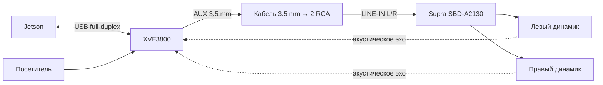
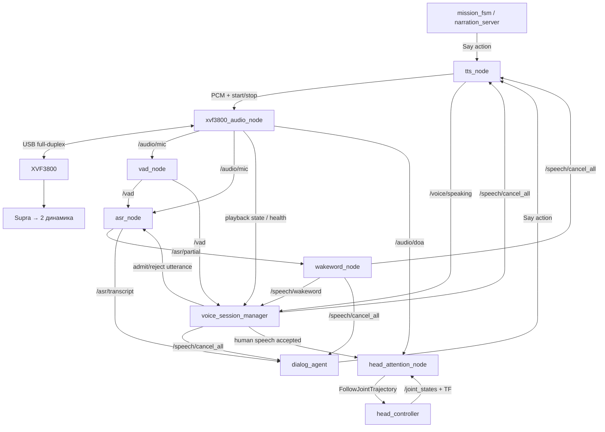
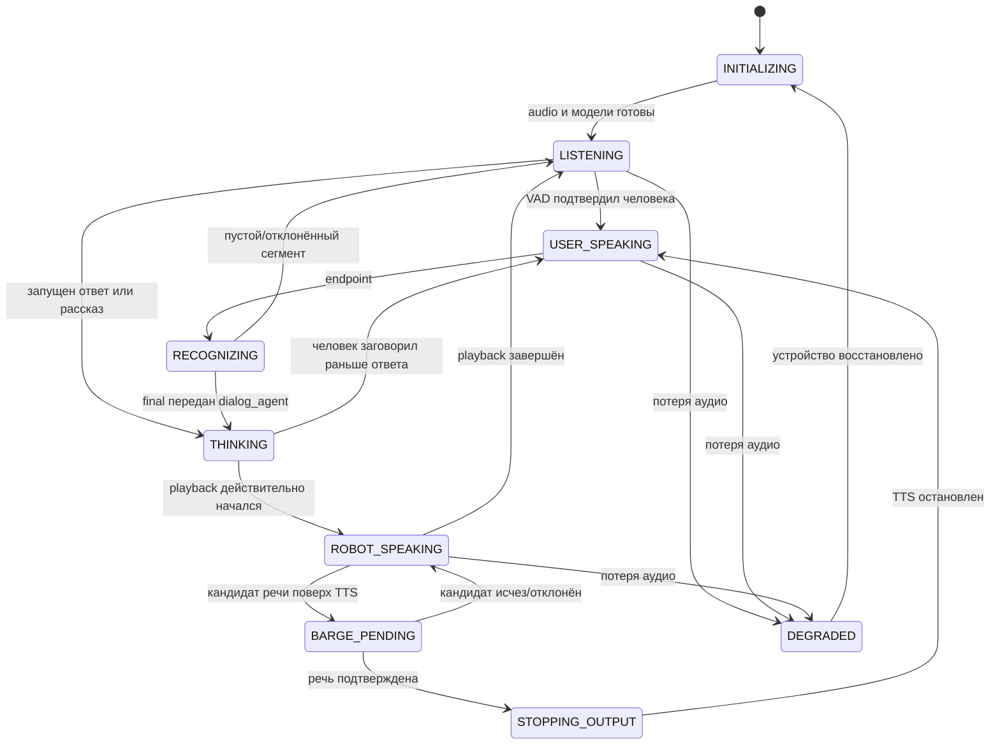
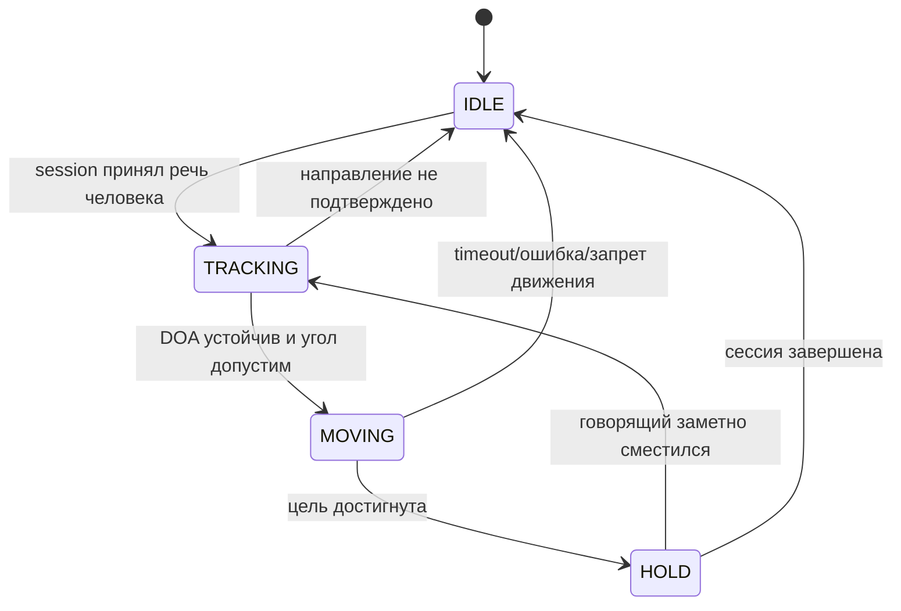

# Краткий план внедрения XVF3800 в ROS 2

Дата: 13 сентября 2026 года. Статус: рабочий план для поэтапной реализации.

Подробное обоснование решений находится в
[xvf3800_voice_architecture.md](xvf3800_voice_architecture.md). Этот документ
фиксирует только состав работ и целевые связи. Детали каждого этапа будут
уточняться непосредственно перед реализацией.

## 1. Зафиксированная конфигурация

- вычислитель: Jetson, ROS 2 Humble;
- микрофонный массив: ReSpeaker XVF3800 по USB;
- усилитель: установленный двухканальный Supra SBD-A2130;
- акустика: два пассивных динамика, по одному на канал Supra;
- воспроизведение: Jetson → USB playback XVF3800 → AUX 3,5 мм →
  2 × RCA `LINE-IN` Supra → два динамика;
- захват: обработанный AEC-канал XVF3800 → USB capture → VAD и ASR;
- основные функции: full-duplex, barge-in, защита от собственного TTS,
  определение направления речи и поворот головы.

Supra не является ROS-устройством и не участвует в обработке звука. В первой
версии он постоянно включён. Управление входом `REM` для экономии батареи можно
добавить отдельным этапом после измерения тока и задержки включения.

## 2. Физический тракт



Критическое условие AEC: весь звук робота должен попадать в Supra через
playback XVF3800. Прямой вывод TTS через PulseAudio, UM2 или другой ЦАП обойдёт
внутренний reference XVF3800, после чего надёжный barge-in невозможен.

Настройки Supra для речи: `CROSSOVER=FULL`, `BASS BOOST=0 dB`, стереорежим,
без моста. Усиление подбирается ниже уровня клиппинга.

## 3. Целевая схема ROS 2



FSM миссии остаётся владельцем экскурсии. Голосовая FSM не выбирает экспонат,
маршрут или продолжение рассказа: она только координирует человеческую реплику,
TTS и отмену текущего хода.

## 4. Ноды

### 4.1. Новые ноды

| Нода | Назначение |
|---|---|
| `xvf3800_audio_node` | Единственный владелец USB capture/playback XVF3800; публикует обработанный звук, DOA, состояние playback и диагностику |
| `voice_session_manager` | FSM голосовой сессии; подтверждает barge-in, отменяет TTS/LLM, допускает или отклоняет ASR-сегмент |
| `head_attention_node` | Фильтрует DOA принятой человеческой речи и отправляет безопасную команду поворота головы |

`xvf3800_audio_node` целесообразно реализовать в новом пакете
`guide_robot_audio` на C++ для предсказуемой работы ALSA. Две остальные ноды
могут находиться в `guide_robot_voice`; их логика не требует собственного
доступа к звуковому устройству.

### 4.2. Изменяемые существующие ноды

| Нода | Изменение |
|---|---|
| `audio_frontend` | Не запускается в XVF3800-профиле; остаётся для старых USB-микрофонов и стенда |
| `tts_node` | Сохраняет `Say`, синтез и очередь, но передаёт PCM в `xvf3800_audio_node`, а не открывает Pulse/ALSA самостоятельно |
| `vad_node` | Работает по обработанному `/audio/mic`; перестаёт самостоятельно публиковать автоматический barge-in |
| `asr_node` | Постоянно хранит pre-roll, не гейтируется по TTS и публикует final только для сегмента, принятого session manager |
| `wakeword_node` | Сохраняет текущие `/speech/wakeword` и прямой `/speech/cancel_all`; session manager подписывается на них, чтобы синхронизировать FSM |
| аппаратный слой головы | Добавляются сустав головы, state/command interfaces и контроллер траектории в `ros2_control` |

### 4.3. Ноды без изменения публичного контракта

- `dialog_agent` получает `/asr/transcript` и реагирует на существующий
  `/speech/cancel_all`;
- `narration_server` продолжает вызывать `Say` и отвечает за resume рассказа;
- `mission_fsm` сохраняет состояния экскурсии `narrating`, `answering`,
  `paused` и остальные;
- `presence_monitor` после подтверждения AEC сможет учитывать VAD во время TTS.

## 5. Основные интерфейсы

На первом этапе переиспользуются существующие контракты:

| Интерфейс | Роль |
|---|---|
| `/audio/mic`, `AudioChunk` | Обработанный mono PCM для VAD и ASR |
| `/vad`, `VoiceActivity` | Начало, продолжение и конец речевой активности |
| `say`, `Say.action` | Публичный запрос озвучивания |
| `/voice/speaking`, `SpeakingStatus` | Фактическое состояние воспроизведения |
| `/speech/cancel_all`, `CancelAll` | Отмена TTS, LLM-хода и рассказа при barge-in |
| `/asr/partial`, `/asr/transcript` | Частичный и финальный текст посетителя |
| `/audio/doa`, `Doa` | Азимут и качество направления речи |
| `/joint_states`, TF | Текущее положение головы |
| `FollowJointTrajectory` | Команда приводу головы |

Новые внутренние сообщения потребуются для состояния playback и решения
`ADMIT/REJECT` по конкретному `utterance_id`. Их точная структура определяется
при реализации `xvf3800_audio_node` и `voice_session_manager`. Существующие
публичные интерфейсы менять без необходимости не следует.

## 6. FSM голосовой сессии



Краткий смысл состояний:

- `LISTENING`: непрерывный capture, VAD, ASR pre-roll и DOA;
- `USER_SPEAKING`: сохраняется одна принятая реплика человека;
- `RECOGNIZING`: ASR завершает final, но capture не останавливается;
- `THINKING`: LLM/TTS готовит ответ, человек всё ещё может перебить;
- `ROBOT_SPEAKING`: TTS звучит, AEC и VAD продолжают работать;
- `BARGE_PENDING`: короткое подтверждение, чтобы шум не останавливал робота;
- `STOPPING_OUTPUT`: отмена, fade-out и очистка очереди старого ответа;
- `DEGRADED`: AEC/full-duplex не подтверждены, автоматический barge-in закрыт.

Для подтверждённого barge-in должны одновременно выполняться условия:

```text
audio_ready
and aec_profile_valid
and playback_state_fresh
and current_say_interruptible
and processed_vad_confirmed
and utterance_not_already_handled
```

DOA не входит в обязательный guard: при плохом направлении робот должен
остановить речь и слушать, просто не поворачивая голову.

## 7. FSM поворота головы



Голова поворачивается только по DOA принятой человеческой реплики. Единичное
измерение, остаточное эхо TTS и шум не создают команду движения. Угол
преобразуется из системы координат массива через TF, ограничивается пределами
сустава и отправляется стандартному контроллеру траектории.

## 8. Порядок реализации

### Этап 1. Аудиотракт XVF3800

- определить ALSA-карту, playback/capture endpoints и processed-канал;
- реализовать `xvf3800_audio_node` и новый аппаратный YAML-профиль;
- получить одновременные стабильные capture и playback без Pulse/UM2;
- вывести AUX XVF3800 в `LINE-IN` Supra и настроить уровни.

**Готово, когда:** TTS идёт только через XVF3800 и оба динамика, а обработанный
микрофонный поток непрерывно приходит в ROS 2.

### Этап 2. TTS и отмена

- подключить `tts_node` к playback-интерфейсу audio owner;
- связать `/voice/speaking` с фактическим началом и концом PCM;
- реализовать ограниченный буфер, fade-out и очистку старого поколения PCM.

**Готово, когда:** отмена гарантированно останавливает звук и старый ответ не
возвращается после новой реплики.

### Этап 3. AEC и full-duplex

- проверить, что XVF3800 получает правильный playback reference;
- выбрать processed capture-канал и настроить уровни Supra;
- отключить `gate_on_tts` в ASR-профиле;
- измерить ложный VAD на TTS и разборчивость речи человека поверх TTS.

**Готово, когда:** собственный голос не формирует принятую реплику, а речь
человека поверх динамиков обнаруживается.

### Этап 4. Голосовая FSM и barge-in

- реализовать `voice_session_manager`;
- перенести в него единоличное решение об автоматическом barge-in;
- связать VAD-кандидат, остановку TTS, ASR pre-roll и отмену LLM;
- защититься от поздних сообщений идентификаторами сессии/реплики.

**Готово, когда:** посетитель перебивает TTS без потери первого слова, а шум и
собственный TTS не вызывают отмену.

### Этап 5. DOA и голова

- публиковать валидный `/audio/doa`;
- добавить сустав и контроллер головы в `ros2_control`;
- реализовать фильтрацию направления, ограничения угла и FSM внимания;
- разрешать движение только для принятой человеческой реплики.

**Готово, когда:** робот поворачивается к устойчивому источнику речи и остаётся
неподвижным при собственном TTS и невалидном DOA.

### Этап 6. Интеграция

- добавить XVF3800-профиль и новые ноды в voice launch/lifecycle manager;
- включить профиль в `high_level_stack.launch.py` и supervisor;
- проверить рассказ, вопрос, barge-in, стоп-слово, resume и восстановление USB;
- записать rosbag с аудио, VAD, playback state, ASR, DOA и состояниями FSM.

## 9. Решения, отложенные до соответствующего этапа

- точный формат внутренних `PlaybackState` и `UtteranceDecision`;
- ALSA transport PCM между Python TTS и C++ audio owner;
- пороги VAD, длительность подтверждения barge-in и pre-roll;
- версия прошивки и USB control API XVF3800;
- фильтр DOA, скорость и пределы головы;
- управление `REM` Supra и политика его выключения;
- численные критерии задержки после стендовых измерений.

Эти решения не блокируют начало первого этапа и должны приниматься по данным с
реального робота, а не переноситься из предварительных оценок.
