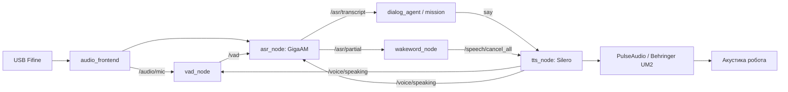
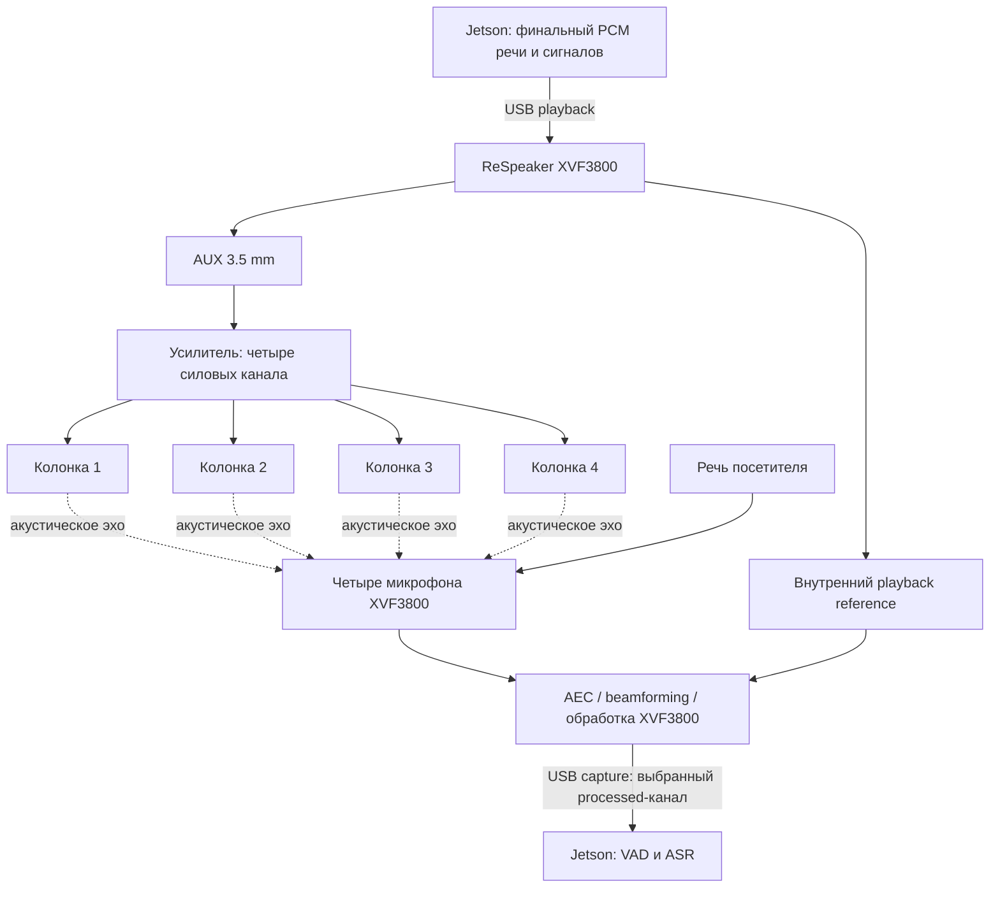
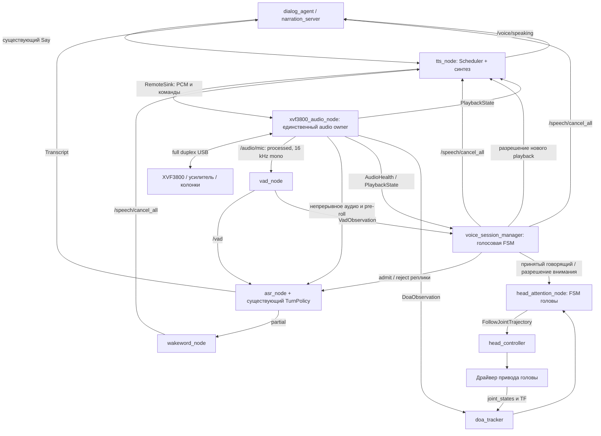
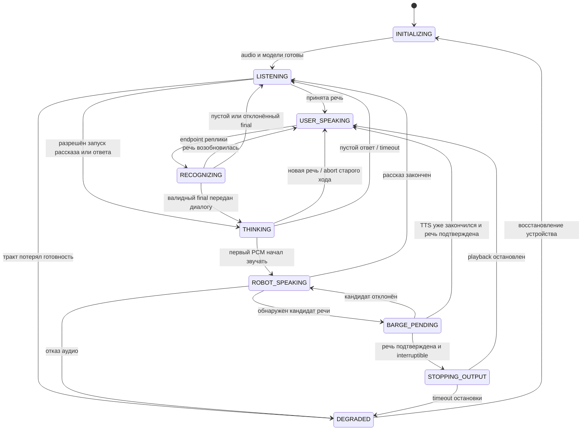
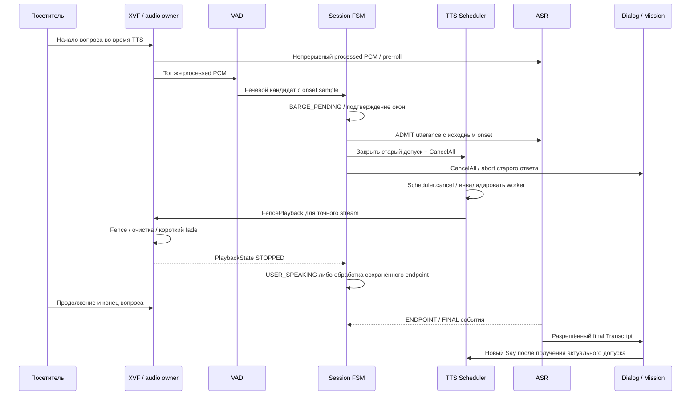
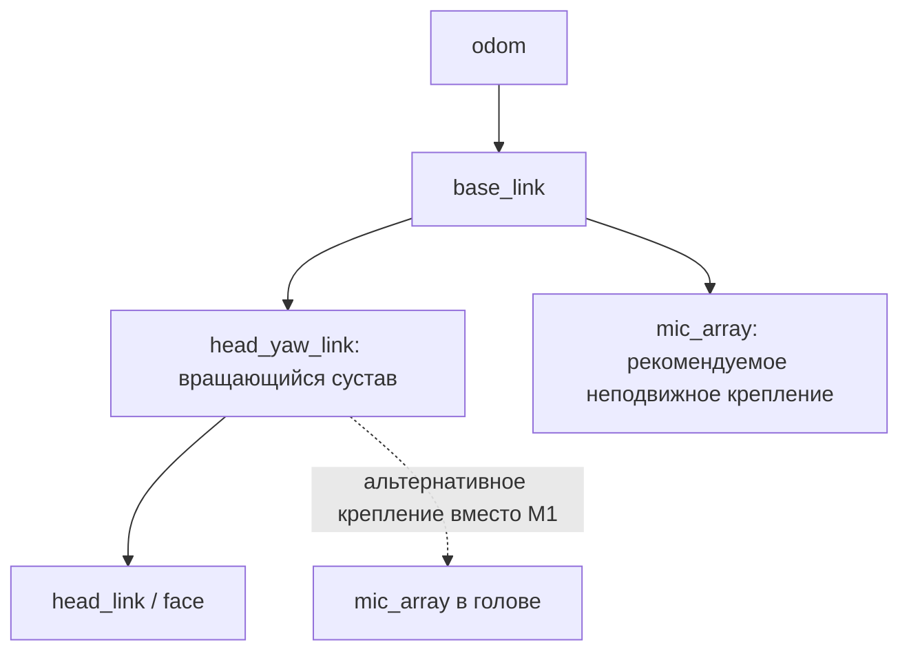
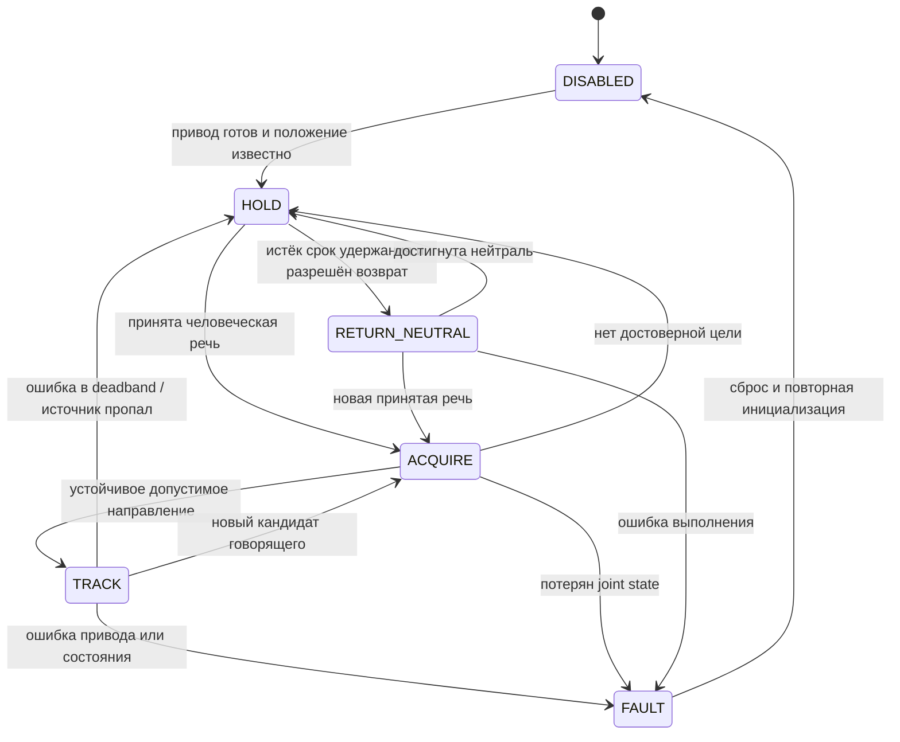
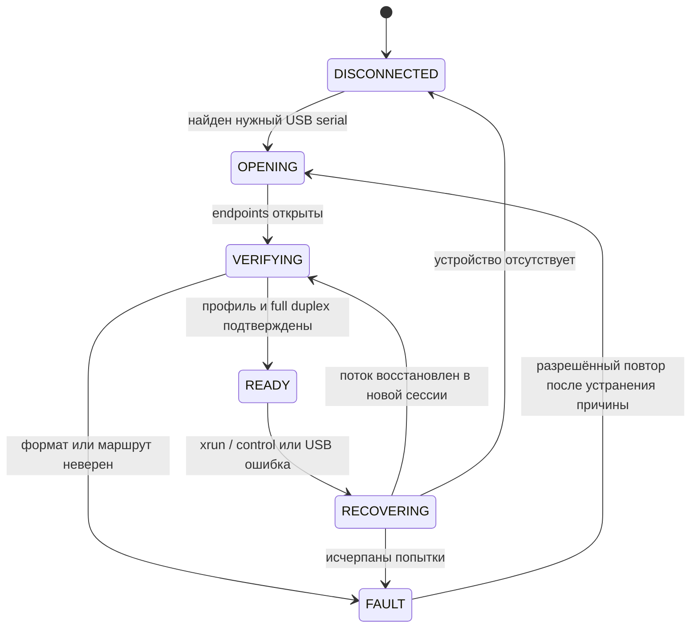
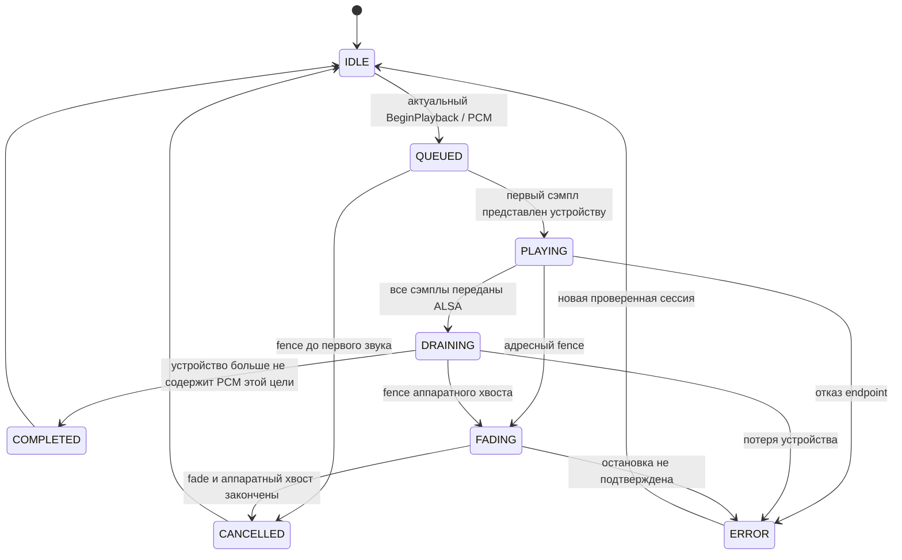
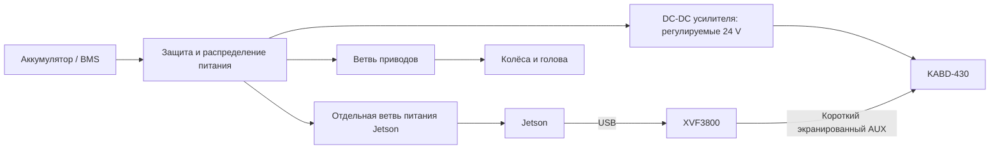

# Голосовая система Robo-guide: ReSpeaker XVF3800, barge-in, FSM и поворот головы

Дата: 13 сентября 2026 года. Статус: проект архитектуры для последующей реализации и испытаний на роботе.

Документ подготовлен по приложенному `xvf3800_jetson_ros2_implementation_plan(1).md`, исходному коду Robo-guide и документации производителей. Указания исполнителю внутри приложения рассматриваются как содержание исходного плана. Текущая задача — спроектировать систему и подобрать усилитель; приведённые ниже новые узлы, сообщения и параметры ещё не реализованы.

**Предлагаемое решение:** весь звук робота проходит через USB playback XVF3800, затем через его AUX-выход, четырёхканальный усилитель и четыре колонки. Массив непрерывно возвращает обработанный сигнал в VAD/ASR. Голосовая FSM подтверждает речь человека, останавливает текущий ответ, сохраняет начало новой реплики и разрешает голове повернуться на устойчивое направление. Существующая FSM миссии продолжает управлять экскурсией.

**Предварительный выбор усилителя — Dayton Audio KABD-430.** Он подходит для схемы с четырьмя отдельными пассивными колонками; расчётный вариант в этом документе — 8 Ω на канал и стабилизированное питание 24 V. Параметры имеющихся колонок и бортового питания пока неизвестны. Поэтому это обоснованный кандидат, а не подтверждение совместимости с неосмотренной акустикой. Подробности, альтернативный вариант без DSP и расчёты находятся в разделах 13–15.

## Содержание

1. [Требования и границы решения](#1-требования-и-границы-решения)
2. [Что уже есть в репозитории](#2-что-уже-есть-в-репозитории)
3. [Физический тракт и подавление собственного голоса](#3-физический-тракт-и-подавление-собственного-голоса)
4. [Прошивка, каналы и время](#4-прошивка-каналы-и-время)
5. [Структура узлов ROS 2](#5-структура-узлов-ros-2)
6. [Контракты и отмена воспроизведения](#6-контракты-и-отмена-воспроизведения)
7. [FSM голосовой сессии](#7-fsm-голосовой-сессии)
8. [Barge-in по шагам и бюджет задержки](#8-barge-in-по-шагам-и-бюджет-задержки)
9. [Определение направления и поворот головы](#9-определение-направления-и-поворот-головы)
10. [FSM головы](#10-fsm-головы)
11. [Ошибки, восстановление и lifecycle](#11-ошибки-восстановление-и-lifecycle)
12. [Конфигурация и структура файлов](#12-конфигурация-и-структура-файлов)
13. [Выбор усилителя](#13-выбор-усилителя)
14. [Подключение четырёх колонок](#14-подключение-четырёх-колонок)
15. [Питание, громкость и размещение](#15-питание-громкость-и-размещение)
16. [План внедрения](#16-план-внедрения)
17. [Проверки и критерии приёмки](#17-проверки-и-критерии-приёмки)
18. [Инвентаризация перед сборкой](#18-инвентаризация-перед-сборкой)
19. [Источники и объяснение терминов](#19-источники-и-объяснение-терминов)

## 1. Требования и границы решения

### 1.1. Поведение, которое должен получить посетитель

Робот рассказывает об экспонате. Посетитель начинает: «Подожди, а кто это сделал?» Робот прекращает рассказ в пределах заданной задержки, сохраняет слово «подожди» целиком, поворачивает голову в сторону посетителя и слушает вопрос. Затем отвечает. Возобновление экскурсии, если оно необходимо, выполняет FSM миссии с учётом реально произнесённого текста.

Микрофоны, VAD и накопление аудио работают во время рассказа, остановки звука, поворота головы и ожидания ответа LLM. Тяжёлое распознавание и генерация ответа не должны задерживать остановку динамиков.

| Требование | Что именно означает | Чем обеспечивается |
|---|---|---|
| Робот не слышит себя как посетителя | Собственный TTS не запускает новую реплику, стоп-слово или поворот головы | Правильный reference, аппаратный AEC, проверка остаточного эха, политика сессии |
| Barge-in | Человек может начать говорить поверх TTS | Непрерывный capture, VAD по processed audio, короткая отмена playback |
| Сохранение начала фразы | До ASR доходит речь до момента подтверждения VAD | Pre-roll по индексам сэмплов, отсутствие очистки реплики при остановке TTS |
| Поворот головы | Голова ориентируется на устойчивый источник человеческой речи | DOA, временная фильтрация, TF на момент измерения, контроллер сустава |
| Четыре колонки | Каждая получает собственный силовой канал | Четырёхканальный усилитель, один динамик на канал |
| Отсутствие старого ответа после отмены | Поздний результат TTS/LLM не возвращается в динамики | Идентификаторы сессий, поколение playback, запрет нового старта до завершения хода |
| Восстановление после USB-сбоя | Понятное состояние без случайного продолжения старой фразы | Отдельная FSM аудиоустройства, очистка поколений и повторная проверка маршрута |

### 1.2. Что нельзя обещать только архитектурой

AEC не создаёт физическую тишину возле микрофонов. Он уменьшает составляющую звука, объяснимую известным сигналом воспроизведения. При перегрузке усилителя, вибрациях корпуса, изменении акустики и одновременной речи остаточное эхо возможно.

Требование «не слышать себя» проверяется функционально: в оговорённых условиях нет ложных действий от собственного звука, а речь человека сохраняется. Нулевой цифровой сигнал при любом положении робота не является реалистичным критерием.

Четыре микрофона не означают четыре независимых ASR-потока, а четыре колонки не означают четыре независимых USB playback-канала. В первой версии все колонки воспроизводят одну речь, с постоянными согласованными уровнями. Это рабочее допущение до уточнения требований к акустике.

### 1.3. Что считаем отдельными слоями

- Аудиодрайвер отвечает за устройство, PCM, короткие буферы и достоверный статус воспроизведения.
- VAD определяет наличие речи в обработанном сигнале, но не личность говорящего и не его намерение.
- Голосовая FSM управляет очередностью реплик и перебиванием.
- ASR преобразует сохранённую реплику в текст.
- DOA и FSM головы управляют вниманием и движением головы.
- FSM миссии решает, прерывать ли экскурсию, отвечать ли на вопрос и откуда продолжать рассказ.

Такое разделение позволяет тестировать голос без моторов и голову без LLM.

## 2. Что уже есть в репозитории

### 2.1. Фактический текущий тракт



Схема соответствует Jetson-профилю в репозитории; фактическое подключение на физическом роботе ещё надо сверить.

| Компонент | Что подтверждено кодом | Последствие для внедрения |
|---|---|---|
| [voice_jetson.yaml](../guide_robot_voice/config/voice_jetson.yaml) | Вход `USB PnP Audio Device`, 48 kHz; выход TTS `pulse`, 48 kHz | Заменить аппаратный профиль и старую маршрутизацию |
| [audio_frontend.py](../guide_robot_voice/guide_robot_voice/audio_frontend.py) | Захват через sounddevice, преобразование в 16 kHz mono | Переиспользовать формат и framing; владение ALSA перенести в audio owner |
| [vad_node.py](../guide_robot_voice/guide_robot_voice/vad_node.py) | Окно Silero 512 сэмплов; есть собственная публикация barge-in | В новом режиме оставить VAD-оценку, автоматическую отмену передать session manager |
| [asr_node.py](../guide_robot_voice/guide_robot_voice/asr_node.py) | Pre-roll, partial/final ASR и сегментация уже реализованы | Новый независимый segmenter не нужен |
| [tts_node.py](../guide_robot_voice/guide_robot_voice/tts_node.py) | `Say`, Scheduler, scope, interruptible, `EpochFencedSink` | Сохранить внешний `Say`; заменить аппаратный sink на клиент аудиосервиса |
| [sink.py](../guide_robot_voice/guide_robot_voice/lib/sink.py) | Локальное поколение PCM и отмена с fade-out | Сохранить принцип, расширить на межпроцессный транспорт |
| [dialog_agent_node.py](../guide_robot_llm/guide_robot_llm/dialog_agent_node.py) | Слушает `CancelAll`, выставляет событие abort текущего хода | Переиспользовать, добавить проверку поздних результатов |
| [root_sm.py](../guide_robot_mission_control/guide_robot_mission_control/fsm/root_sm.py) | Уже есть `narrating`, `answering`, `paused`, `held` и другие состояния миссии | Голосовая FSM не заменяет эту машину |
| [Doa.msg](../guide_robot_msgs/msg/Doa.msg) | Уже определены `azimuth`, `beam_snr_db`, `voice_active` | Не создавать второе сообщение с тем же назначением без migration plan |
| [guide_robot.ros2_control.xacro](../guide_robot_description/urdf/guide_robot.ros2_control.xacro) | В аппаратном компоненте объявлены два колёсных сустава | Для головы нужен новый аппаратный контракт |
| [guide_robot_hardware.xml](../guide_robot_hardware/guide_robot_hardware.xml) | Регистрация pluginlib-класса `GuideRobotSystem` | Этот XML сам по себе не описывает микрофон, DSP или сустав головы |

В проекте указан ROS 2 Humble. Скрипт `scripts/create_rules.sh` упоминает Jetson Orin Nano, Docker-профиль — JetPack 6.1 / L4T r36.4. Это свидетельства о целевой платформе, а не результат опроса текущего Jetson.

### 2.2. Изменения, без которых новая схема не заработает

**Первое: аппаратный AEC сейчас не интегрирован.** В Jetson-профиле `require_aec_for_barge_in: true`, а текущая реализация VAD при этом безусловно прекращает обработку автоматического barge-in. Переключение флага на `false` лишь снимает блокировку; оно не подтверждает работоспособность AEC.

**Второе: ASR сейчас защищается от TTS гейтированием.** В профиле включены `gate_on_tts: true` и `wakeword_listen_during_tts: true`: во время речи робота допускается специальное прослушивание для ключевых фраз. Для XVF-профиля необходим обычный full-duplex путь после AEC.

**Третье: обработчик `_on_speaking_status()` в ASR при переходе `speaking=true → false` закрывает открытое высказывание без проверки `gate_on_tts`.** При barge-in это может уничтожить начало вопроса посетителя. В новой реализации закрытие и echo-hold относятся только к старому shadow-режиму. Остановка TTS в full-duplex режиме не закрывает реплику человека и не очищает pre-roll.

**Четвёртое: текущий TTS ставит `_speaking=False` непосредственно после вызова `sink.bump()`.** Физический fade-out или уже переданный аппаратуре буфер могут ещё звучать. Новый статус должен учитывать фактически поданные на DAC сэмплы и ограниченную аппаратную задержку.

**Пятое: комментарий `CancelAll.msg` и реальная обработка epoch расходятся.** В сообщении говорится о счётчике отправителя, издатели обычно отправляют ROS-время, а TTS не сравнивает входящий `msg.epoch` и использует локальное поколение sink. Новый transport fencing нельзя строить на предположении, что готовый общий счётчик уже существует.

**Шестое: [jetson_audio.sh](../scripts/jetson_audio.sh) настраивает старый микрофон и UM2.** При XVF-профиле потребуется другой режим сервиса. Простая замена `device` в YAML не устраняет внешний выбор Pulse sink и захват устройства аудиосервером.

### 2.3. Что сохранить

Публичные `Say`, `CancelAll`, `SpeakingStatus`, `/audio/mic`, `/vad`, `/asr/partial`, `/asr/transcript` и семантику возобновления рассказа следует сохранить. Новые аппаратные сведения добавляются отдельными интерфейсами. Реализацию Silero, GigaAM, `TurnPolicy`, Scheduler и FSM миссии переписывать целиком не требуется.

## 3. Физический тракт и подавление собственного голоса

### 3.1. Основная схема



Seeed указывает для платы USB Audio Class 2.0, AUX-выход для наушников/активной акустики и обработку AEC/beamforming/DOA. Используем AUX как источник сигнала для высокоомного аналогового входа внешнего усилителя. Это headphone-выход, поэтому допустимый уровень на входе усилителя проверяется отдельно. [Seeed: описание платы](https://wiki.seeedstudio.com/respeaker_xvf3800_introduction/).

USB capture и USB playback должны принадлежать одной физической плате. Возврат processed audio с XVF3800 при воспроизведении через UM2 не создаёт правильный reference автоматически.

### 3.2. Что делает AEC

Для одного микрофона упрощённая модель такова:

```text
y(t) = s(t) + h(t) * x(t) + n(t)
e(t) = y(t) - h_est(t) * x(t)
```

`x(t)` — известный сигнал, направленный в динамики; `s(t)` — голос человека; `h(t)` — акустический путь от динамиков к микрофону; `n(t)` — прочий шум. Знак `*` означает свёртку: отражения приходят с разными задержками и уровнями. AEC оценивает путь `h_est` и удаляет предсказанное эхо. Это объясняющая модель, а не полное описание закрытого алгоритма XVF3800.

Reference — именно аудиосэмплы, а не текст TTS, состояние `speaking=true` или команда «начать говорить». В него должны попасть изменения скорости, громкости и смешивание сигналов, выполненные на Jetson до USB playback.

XMOS отдельно описывает требования к причинности и согласованию задержек reference и микрофонного тракта. Пропуск сигнала через XVF3800 перед усилителем даёт подходящую основу, но настройки конкретной платы всё равно проверяются измерением. [XMOS User Guide, раздел 4.2](https://www.xmos.com/documentation/XM-014888-PC/pdf/xvf3800_user_guide_v3.2.1.pdf).

### 3.3. Почему четыре колонки совместимы с одной речью

Если все четыре колонки воспроизводят один сигнал с постоянными коэффициентами усиления:

```text
echo_m(t) = Σ(i=1..4) h_mi(t) * [g_i · x(t)]
          = h_effective_m(t) * x(t)
```

Для каждого микрофона получается суммарный акустический путь от всех колонок. Из этой линейной модели следует, что число колонок само по себе не требует четырёх независимых reference-каналов. Однако больше источников и отражений усложняют адаптацию. Это инженерный вывод, а не обещание качества AEC при любой расстановке.

В первой версии передаём одинаковый mono TTS в L и R поддерживаемого USB playback-профиля. На усилителе создаём четыре копии с фиксированными уровнями. Нельзя считать количество USB capture-каналов количеством доступных playback-каналов.

Для четырёх **разных** независимых программ одного стереофонического AUX недостаточно. Потребуется отдельный проект многоканального воспроизведения и доставки всех независимых reference в совместимый AEC. Независимую статическую громкость четырёх копий одного TTS можно настроить уже в предлагаемой схеме.

### 3.4. Что ломает подавление собственного голоса

| Причина | Почему возникает проблема | Проектное решение |
|---|---|---|
| TTS через другую звуковую карту | XVF не получает нужный синхронный сигнал | Один выход всех программных звуков через XVF |
| Bluetooth непосредственно в усилитель | Новый звук добавляется после точки reference | Bluetooth-вход усилителя исключить из рабочей матрицы |
| Клиппинг AUX, усилителя или ADC | Нелинейные искажения плохо описываются линейной моделью эха | Настроить запас уровней на каждом этапе |
| Bass enhancement, компрессор или переменная задержка после XVF | Между reference и звуком появляются нелинейные либо меняющиеся преобразования | В первой версии фиксированная линейная маршрутизация |
| Переключение колонок или резкий поворот массива | Быстро меняется акустический путь | Фиксированная расстановка, плавное движение, проверка адаптации |
| Вентилятор, редуктор, вибрация | Это шум, которого нет в playback reference | Механическая развязка, размещение, шумовые испытания |
| Усреднение processed и raw capture-каналов | Необработанный голос робота возвращается в ASR | Явный выбор проверенного processed-канала |

Все программные сигналы робота, включая приветствие, подтверждения и уведомления, должны идти через тот же audio owner. Если остаётся отдельная аппаратная сирена, её режим явно отмечается как исключение с недоступным автоматическим barge-in; нельзя ожидать, что AEC уберёт неизвестный звук.

### 3.5. Какие обработки оставить

На первом стенде используем аппаратную обработку XVF3800 и существующий Silero VAD. Не добавляем второй AEC, AGC, beamformer или нейросетевой denoiser. Это выбранный порядок эксперимента: сначала понять результат базового тракта, затем добавлять обработку только при измеримом улучшении распознавания и double-talk.

В адаптере допустимы преобразование формата, нужный ресемплинг и сборка кадров. Дополнительный HPF 40 Hz и gain из старого фронтенда в XVF-профиле по умолчанию отключаем; повторно вводим только по результату измерений.

## 4. Прошивка, каналы и время

### 4.1. Сначала паспорт конкретного устройства

У семейства XVF3800 различаются USB/I2S-прошивки, профили частоты и маршрутизация каналов. Текущая wiki Seeed перечисляет образы с явно указанными `16k6ch` и `48k2ch`, а для общего имени прошивки не гарантирует эти параметры. Нельзя переносить карту каналов из примера другой платы или другой версии прошивки. [Seeed: firmware](https://wiki.seeedstudio.com/respeaker_xvf3800_introduction/).

Для каждой принятой комбинации фиксируем:

```text
board_model, board_revision, USB serial, VID:PID
firmware_version, firmware_file_sha256, control_tool_revision
capture: endpoint, sample_rate, sample_format, channels
playback: endpoint, sample_rate, sample_format, channels
capture_channel -> фактически проверенный сигнал
output_mux_readback, reference_route_readback
gain_settings, amplifier_profile_hash, installation_id
```

Capture и playback проверяются **раздельно и одновременно**. Например, название `16k6ch` не даёт права без проверки назначить playback шесть каналов.

При инициализации сначала читаем конфигурацию, сравниваем с паспортом, затем применяем только профиль, рассчитанный на эту прошивку. Несовпадение карты каналов блокирует готовность голосового тракта.

### 4.2. Выбор рабочего сигнала

Официальный репозиторий ReSpeaker описывает выбор выходов через `AUDIO_MGR_OP_L/R`; описание Seeed-профиля и стандартные настройки XMOS evaluation firmware могут различаться. Команды и значения mux надо брать из согласованной версии host control, а выбранный канал проверить на речи и собственном TTS. [ReSpeaker host_control](https://github.com/respeaker/reSpeaker_XVF3800_USB_4MIC_ARRAY/blob/master/host_control/README.md).

Алгоритм проверки:

1. Снять многоканальную запись при речи человека и при TTS без человека.
2. Сверить назначение каналов с readback mux и документацией прошивки.
3. Выбрать ASR/processed-сигнал с работающим AEC.
4. Проверить отсутствие подмешивания raw и reference.
5. Сохранить карту каналов вместе с WAV и паспортом.

Raw-каналы полезны для диагностики, но их постоянная публикация не нужна для рабочей VAD/ASR-цепочки. Не обещаем одновременную доступность raw, processed и reference в каждой прошивке.

### 4.3. Формат существующего `/audio/mic`

Сохраняем [AudioChunk.msg](../guide_robot_msgs/msg/AudioChunk.msg): `header`, `sample_rate`, `channels`, `int16[] data`, `first_sample`. У него нет поля `encoding`; формат уже задан контрактом как interleaved PCM int16.

Для текущего downstream:

- 16 000 сэмплов/с;
- один канал;
- 256 сэмплов в кадре, то есть 16 ms;
- Silero VAD собирает два кадра в окно 512 сэмплов, то есть 32 ms;
- `first_sample` индексирует сэмплы **выходного mono-потока**, а не исходные 48 kHz и не байты USB.

Поэтому предложение исходного плана о 20 ms кадрах не переносим автоматически. Внутренний ALSA period может быть около 10 ms, а адаптер накопит из этих блоков необходимые 256 сэмплов.

Если capture уже 16 kHz, ресемплинг не нужен. Если он 48 kHz — один stateful-ресемплер перед `/audio/mic`. Playback ресемплируется отдельно из частоты TTS в фактическую частоту endpoint. Состояние фильтра сохраняется между блоками одной реплики и сбрасывается при разрыве/отмене соответствующего потока.

### 4.4. Временная модель

Три вида времени имеют разные задачи:

| Время | Для чего | Правило |
|---|---|---|
| Счётчик сэмплов | Непрерывность, сборка реплики и pre-roll | Не восстанавливать порядок кадров по времени прихода DDS |
| Steady/monotonic clock | Watchdog, таймауты, latency внутри Jetson | Не зависит от корректировок системных часов |
| ROS time в `header.stamp` | Связь с TF, rosbag и другими ROS-сенсорами | Получается из согласованного отображения времени capture в ROS clock |

В `header.stamp` нельзя просто записать произвольные наносекунды `time.monotonic()`: TF ожидает ту же временную шкалу, что и остальные ROS-сообщения. При скачке ROS clock помечаем разрыв отображения времени и сбрасываем соответствующие накопители.

Для аудио указываем время первого сэмпла кадра с учётом доступной ALSA timestamp/delay-информации. Не выдаём время выполнения callback за точное время ADC без поправки. Если точной аппаратной метки нет, публикуем оценку и её неопределённость в диагностике.

DOA читается через control endpoint и может относиться к внутреннему предыдущему окну DSP. Поэтому у его наблюдения должны быть время получения, оценка времени наблюдения и неопределённость. Во время поворота головы ошибка времени превращается в угловую ошибку: при 30°/s и 100 ms неопределённости это уже около 3°.

После USB reconnect создаётся новый `device_session_id`. Счётчик `/audio/mic` может начаться заново только вместе с явным событием reset потока, очисткой VAD/pre-roll и отбрасыванием поздних кадров предыдущей сессии.

## 5. Структура узлов ROS 2

### 5.1. Целевая топология



`xvf3800_audio_node`, `voice_session_manager`, `doa_tracker`, `head_attention_node` и `head_controller` — проектируемые компоненты. Остальные блоки используют существующий код с описанными ниже изменениями.

### 5.2. `xvf3800_audio_node`: аппаратный владелец

Предлагается небольшой пакет `guide_robot_audio` на C++/`ament_cmake` для ALSA и USB control. Существующий `guide_robot_voice` остаётся Python-пакетом с VAD, ASR, TTS и политикой сессии. Новый пакет оправдан границей аппаратного сервиса и сборки, а не дублированием голосовой логики.

Audio owner открывает capture и playback XVF3800, обслуживает control endpoint, выбирает processed-канал и публикует готовый `/audio/mic`. Отдельный старый `audio_frontend` в XVF-профиле не запускается. Для гарнитуры/Fifine он сохраняется в legacy-профиле.

Общая библиотека преобразований или перенесённый адаптер допустимы; два параллельных издателя `/audio/mic` недопустимы. Не следует переносить Python-модели VAD/ASR в C++ только ради микрофона.

Внутри audio owner нужны независимые контуры:

| Контур | Работа | Чего в нём нет |
|---|---|---|
| Capture | ALSA read, учёт сэмплов, передача блока в ограниченный ring buffer | Синтеза, ASR, ожидания сетевого ответа |
| Playback | Выдача коротких периодов, generation-check, fade, учёт ALSA delay | Выбора темы ответа и приоритетов экскурсии |
| Control | Чтение версии, mux, DOA и аппаратных признаков; стартово 10–20 Hz | Блокировки audio callback на USB control transfer |
| ROS/diagnostics | Публикация кадров/статусов, обработка коротких команд | Длительного удержания общей блокировки устройства |

Единственным планировщиком приоритетов `Say` остаётся `tts_node`. Audio owner хранит ограниченную очередь PCM уже выбранной цели. Он не выбирает заново между «экскурсией» и «ответом».

Требование одного владельца — проектное решение для управления временем и восстановлением. ALSA в принципе допускает раздельные capture/playback handles; проблема не в самом числе handles, а в несогласованных владельцах одного тракта и конкуренции за endpoints.

В паузах между репликами endpoint можно поддерживать потоком цифровых нулей, если это требуется стабильной full-duplex работе конкретной прошивки. Это playback-тишина, а не подмена пропущенных capture-кадров нулями. Потеря входного аудио всегда помечается разрывом.

### 5.3. `tts_node`: публичный API и планировщик

Сохраняются `Say`, chunker, модель, приоритеты, `scope`, `interruptible`, результаты для narration resume. Вместо непосредственного PortAudio sink вводится `RemoteSink`, отправляющий PCM audio owner и получающий фактический прогресс.

`tts_node` остаётся единственным издателем `/voice/speaking`. Источником сведений о фактически начавшемся/закончившемся воспроизведении становится `PlaybackState` audio owner. Синтезирующаяся, но ещё не звучащая фраза не означает `speaking=true`.

При потере audio owner статус не должен становиться ложным подтверждением тишины. Публикуются ошибка и неготовность; heartbeat с неопределённым состоянием трактуется менеджером как `UNKNOWN`, а не как `IDLE`.

`spoken_text` и `spoken_chars` считаются по подтверждённым границам действительно воспроизведённых клауз. Нельзя считать весь отправленный PCM уже прозвучавшим. Для прерванной посередине клаузы точного отображения «сэмпл → символ» у текущего TTS нет: сохраняется консервативная граница, и при resume возможен повтор части предложения.

### 5.4. `vad_node` и `asr_node`

VAD публикует существующий `/vad`; в XVF-профиле собственный `barge_in_enabled` у него выключен. Автоматический barge-in публикует только session manager, использующий ту же VAD-вероятность. Это предотвращает две независимые отмены с разными порогами.

Для точной связи с аудио предлагается дополнительное `VadObservation`: сессия устройства, диапазон сэмплов окна, вероятность, гистерезисное состояние и признак разрыва. Модель Silero запускается один раз; дополнительное сообщение является расширенным представлением того же результата.

ASR постоянно копит pre-roll. Открытая по VAD реплика сначала может быть **предварительной**: менеджер ещё проверяет, можно ли принять её во время TTS. Внешний final не публикуется, пока для этого `utterance_id` не пришёл `ADMIT`. По `REJECT` сегмент отбрасывается. Внутренние partial предварительного сегмента не поступают в обычный диалог.

Для ключевых слов предусмотрен отдельный допуск `KWS_ONLY`: подтверждённый кандидат processed-речи при исправном AEC можно передать keyword detector до разрешения final в диалог. Это необходимо в том числе при `interruptible=false`, чтобы защита от мягкого barge-in не блокировала стоп-слово. Предлагаемый внутренний `/voice/kws_partial` получает только такие partial; подписка существующего `wakeword_node` в XVF-launch переназначается на него. Диагностический raw туда не поступает. Положительное распознавание слова «стоп» остаётся отдельным поводом остановки и не ждёт конца полной реплики.

Конец реплики по-прежнему определяет `TurnPolicy` внутри ASR. Session manager получает событие `ENDPOINT`, но не запускает второй независимый таймер тишины, который дублирует сегментацию.

### 5.5. `voice_session_manager`: владелец очередности разговора

Менеджер объединяет VAD, готовность аудио, состояние playback, события ASR и жизненный цикл текущего ответа. Он решает, допустить ли новую человеческую реплику, отменить ли ответ и когда разрешить следующий.

На входе сохраняются `device_session_id`, `utterance_id`, `turn_id`, `goal_id` и версии состояния. Нельзя сопоставлять события только по «последнему true/false»: поздний результат предыдущего ответа иначе может изменить уже новый ход.

Существующий `/dialog/phase` полезен для интерфейса лица, но не содержит `turn_id` и heartbeat. Для строгой связи ходов потребуется дополнительный внутренний `DialogTurnState` либо расширение внутреннего протокола диалогового адаптера. Менеджер не делает из старого latched `ANSWER` вывод о бесконечно живой генерации.

### 5.6. Кто принимает решения

| Решение | Единственный основной владелец |
|---|---|
| Какие сэмплы сейчас идут в USB | Audio owner |
| Какую `Say`-цель играть следующей | TTS Scheduler |
| Достаточно ли признаков человеческой речи для автоматического перебивания | Voice session manager |
| Где начинается/заканчивается ASR-сегмент | ASR segmenter / TurnPolicy |
| Публиковать ли сегмент в диалог | Session admission + ASR, по одному `utterance_id` |
| Отменить ли текущий LLM-ход | Dialog agent по событию прерывания |
| Возобновить ли рассказ | FSM миссии |
| На какой угол повернуть голову | Head attention controller с motion policy |
| Как исполнить траекторию в допустимых пределах | Контроллер и аппаратный драйвер головы |

## 6. Контракты и отмена воспроизведения

### 6.1. Сохраняемые внешние интерфейсы

| Интерфейс | Существующий тип | Правило новой реализации |
|---|---|---|
| `/audio/mic` | `AudioChunk` | Один publisher, processed mono 16 kHz |
| `/vad` | `VoiceActivity` | Вероятность и состояние той же модели, без второго VAD |
| `/asr/partial`, `/asr/transcript` | `Transcript` | Внешние результаты только принятого сегмента |
| `say` | `Say.action` | Контракт целей и результатов сохраняется |
| `/speech/cancel_all` | `CancelAll` | Существующий широкий путь отмены с прежними scope/interruptible |
| `/voice/speaking` | `SpeakingStatus` | Единственный publisher — TTS, статус основан на playback |
| `/diagnostics`, `/system_event` | Существующие стандартные/проектные типы | Ошибки устройства, разрывы, отмена и восстановление |

### 6.2. Новые внутренние сообщения: минимальный смысл

Ниже приведены проектные поля, а не готовые `.msg`-файлы. Константы и точный IDL фиксируются при реализации.

| Предлагаемый тип / интерфейс | Ключевые поля | Для чего нужен |
|---|---|---|
| `AudioHealth` → `/audio/health` | stamp, device_session_id, capture_ready, playback_ready, route_verified, profile_validated, muted, discontinuity, fault_code | Отличать доступность USB от пригодности голосового тракта |
| `PlaybackState` → `/audio/playback_state` | stamp, device_session_id, goal_id, stream_id, generation, state, submitted_samples, presented_samples_estimate, device_delay_samples, uncertainty_ms | Подтверждать фактический старт и завершение |
| `VadObservation` → `/voice/vad_observation` | stamp, device_session_id, first_sample, sample_count, probability, active, discontinuity | Привязать подтверждение речи к нужным сэмплам |
| `UtteranceControl` → `/voice/input_control` | device_session_id, utterance_id, onset_sample, decision: ADMIT/KWS_ONLY/REJECT, control_sequence | Разрешать/отбрасывать сегмент без потери его начала |
| `UtteranceEvent` → `/voice/utterance_event` | utterance_id, event, start_sample, end_sample, status | Уведомлять FSM об открытии, endpoint, final, discard |
| `VoiceSessionState` → `/voice/session_state` | stamp, state, input_id, turn_id, transition_sequence, reason | Диагностика и согласование внимания |
| `DoaObservation` → `/audio/doa_hw` | header, device_session_id, azimuth, valid, speech_hint_available, speech_hint, beam_index, stability, timing_uncertainty_ms | Полные сведения, которых нет в старом `Doa` |
| `AttentionTarget` → `/attention/target` | header, utterance_id, direction_vector, stability, valid_until | Направление на принятого говорящего, не команда мотору |

`route_verified` означает, что проверены настройки и маршрут reference. `profile_validated` означает наличие успешного стендового протокола для этой конфигурации. Ни одно из этих полей не является измеряемой вероятностью того, что «AEC сейчас удалил всё эхо». При изменении firmware, усилителя, размещения или маршрута прежняя валидация должна считаться неприменимой.

У старого `Doa.msg` есть `beam_snr_db`, но у выбранной прошивки может не быть данных для честного расчёта этого значения. Основным входом tracker станет `DoaObservation`. Совместимый `/audio/doa` с `Doa` можно добавить для внешних клиентов: неизвестное значение передавать как NaN по документированному контракту, а не выдумывать SNR. В текущем коде потребитель `Doa` не обнаружен; менять существующий тип без необходимости не требуется.

### 6.3. PCM-транспорт между Python TTS и C++ audio owner

Для первой реализации разумен простой ограниченный транспорт: одна операция `BeginPlayback` на активную `Say`-цель, затем `PlayPcm.action` для клауз этой цели. Текущий TTS уже синтезирует клаузы, поэтому на первом этапе отдельный бесконечный DDS-поток PCM не обязателен.

Предлагаемый протокол:

```text
BeginPlayback.srv
  request:  say_goal_id, device_session_id, admission_token
  response: accepted, stream_id, generation, max_pcm_samples, reason

PlayPcm.action
  goal:     device_session_id, stream_id, generation, clause_index,
            sample_rate, channels=1, int16[] pcm
  feedback: presented_samples_estimate, buffered_samples
  result:   completed/cancelled/rejected/failed,
            presented_samples_estimate, error

FencePlayback.srv
  request:  request_id, device_session_id, stream_id,
            expected_generation, reason, fade_ms
  response: accepted, resulting_generation, reason

SetOutputAdmission.srv
  request:  request_id, session_revision, turn_id,
            allowed, admission_token, valid_for_ms
  response: applied_revision, accepted, reason
```

Отдельный `PlaybackState` подтверждает, когда fade и аппаратный хвост закончились. Ответ `FencePlayback.accepted=true` означает принятие отмены, а не мгновенную тишину.

Размер action goal и число ожидающих клауз ограничены: например, максимум 10 s PCM на клаузу и не более двух принятых клауз. При mono int16 48 kHz десять секунд занимают 960 kB без транспортных накладных расходов. Более длинная клауза разделяется до передачи. Сериализацию больших запросов выполняет worker, не callback отмены. На Jetson проверяется нагрузка DDS; если она мешает latency, PCM переносится в shared memory, а управляющий протокол сохраняется.

**Очередь PCM в RAM и очередь перед DAC — разные вещи.** В RAM допустим запас на синтез, но аппаратуре выдаются короткие порции с проверкой generation. ALSA playback-buffer настраивается отдельно, стартовая цель — 20–40 ms, а не вся клауза. Только так длинный готовый ответ можно быстро остановить.

Audio owner выдаёт непрозрачный `stream_id` и монотонное поколение внутри своей сессии. PCM с неправильным `device_session_id`, закрытым `stream_id` или старым поколением отвергается. Старый `CancelAll.epoch` не заменяет этот механизм.

### 6.4. Отмена: порядок важнее названий API

1. Session manager подтверждает перебивание и закрывает допуск новых обычных ответов для прерываемого хода.
2. Публикуется существующий `CancelAll(reason=barge_in, scope=ALL)`. `stamp` сохраняет время начала человеческой речи.
3. `tts_node` сначала вызывает Scheduler.cancel: только он знает, какие цели затронуты scope и защищён ли активный контент.
4. Если активная цель отменена, её локальный токен становится недействительным. Любой поздний результат синтеза этой цели отбрасывается.
5. TTS немедленно отправляет `FencePlayback` с **точным** stream/generation отменённой цели. Никакой синтез или ожидание конца клаузы на этом пути не допускаются.
6. Audio owner атомарно делает старое поколение недействительным, очищает ещё не выданный PCM, воспроизводит короткий fade и подтверждает `STOPPED` после ограниченного аппаратного хвоста.
7. ASR продолжает ту же человеческую реплику. Прерывание output не сбрасывает capture.

Audio owner не должен безусловно глушить физический output на любой `/speech/cancel_all`: это разрушило бы существующую защиту scope/interruptible. В этой версии raw `CancelAll` обрабатывает TTS, а audio owner получает уже адресную отмену. Если позже потребуется прямой быстрый путь в audio owner, семантику допуска и scope придётся формализовать там, а не обходить её.

`FencePlayback` идемпотентен по `request_id` и паре stream/generation. Повторная доставка возвращает результат предыдущей команды и не отменяет новую цель. Текущий подход «bump идемпотентен на пустом sink» нельзя без изменений переносить на сеть, где новая цель могла уже начаться.

### 6.5. Закрытие допуска и гонки

`admission_token` — разрешение session manager на запуск конкретного актуального ответа. Он связан с `turn_id` и версией состояния сессии. При входе в принятую человеческую реплику разрешение старого ответа отзывается. Сам менеджер не хранит очередь TTS-приоритетов.

`SetOutputAdmission` применяет новую ревизию допуска в TTS и audio owner; оба отвергают более старые ревизии. Отзыв допуска и fence не ждут завершения синтеза. В audio owner проверка допуска при первом выводе и применение отзыва сериализованы одним управляющим контуром. Токен проверяется не только на `BeginPlayback`, но и непосредственно перед первым сэмплом: уже принятый, но ещё не стартовавший goal не должен обойти отзыв. FSM считает барьер остановки завершённым после подтверждения отзыва обоими владельцами и `STOPPED` затронутого stream; при отсутствии активного stream достаточно отзыва и достоверного idle. Это закрывает гонку новой цели с отменой предыдущей.

Существующий `Say` не содержит `turn_id`. Поэтому адаптеры dialog/narration перед отправкой и TTS перед приёмом цели должны проверять внутреннее разрешение; завершившийся старый worker не имеет права просто отправить новый `Say` после отмены. Если потребуется поддержка произвольных внешних клиентов с такими гарантиями, понадобится отдельный версионированный API с токеном. Это явно отдельная миграция, а не скрытое поле существующего action.

| Гонка | Требуемое поведение |
|---|---|
| TTS закончил PCM после отмены | Отбрасывание по токену синтеза/поколению |
| Старый PCM пришёл после `FencePlayback` | Audio owner отвергает его до аппаратной очереди |
| `COMPLETED` и cancel пришли почти одновременно | Один терминальный результат на goal; отмена не затрагивает следующий stream |
| ASR final получен раньше `STOPPED` | Final можно сохранить; новый ответ ждёт подтверждения остановки |
| Пользователь продолжил речь, пока декодировался предыдущий final | Создать продолжение/новый input по политике, устаревший ответ не запускать |
| LLM HTTP-запрос не умеет физически отменяться | Результат допускается только при живом turn token; иначе игнорируется |
| Менеджер сессии или TTS умер | Истечение краткой lease блокирует новые starts; текущий обычный PCM завершается остановкой по watchdog |

Устройству задаётся ограниченная lease клиента, например 300 ms с heartbeat 100 ms. Это стартовые величины для теста под нагрузкой; пропуск lease порождает явную ошибку. Запрет нового запуска не должен случайно блокировать согласованный аппаратный путь аварийных сигналов: приоритеты безопасности задаются отдельно от обычного диалога.

### 6.6. QoS и возраст сообщений

Сохраняем текущий `/audio/mic` BEST_EFFORT depth 20 на первом этапе и измеряем потери. При кадре 16 ms двадцать кадров — **320 ms** ёмкости очереди, а не 80 ms, как указано в старом комментарии `lib/qos.py`. Это запас history, не обязательная задержка каждого сообщения. Но медленный subscriber способен накопить отставание, поэтому контролируем возраст кадра.

Состояния health/session/playback: RELIABLE, KEEP_LAST 1, TRANSIENT_LOCAL с heartbeat и проверкой свежести. Команды admission/fence и события с идентификаторами: RELIABLE, VOLATILE, ограниченная очередь. PCM-actions ограничены размером и числом запросов.

Для `VadObservation` можно использовать BEST_EFFORT с несколькими окнами history, но подтверждение речи обязано сбрасываться при пропуске диапазона сэмплов. Нельзя считать три не соседних доставленных окна тремя непрерывными окнами речи. Для событий `ADMIT`, `ENDPOINT`, `STOPPED` нужна надёжная доставка и идемпотентная обработка.

Ни RELIABLE QoS, ни отдельная callback group не дают гарантии жёсткого real-time. Доказательство задержки — измерение под одновременной нагрузкой ASR/LLM/navigation.

## 7. FSM голосовой сессии

### 7.1. Почему машин несколько

Состояние разговора, исправность USB и движение головы — независимые оси. Робот может одновременно слушать посетителя, поворачивать голову и иметь полностью исправное аудиоустройство. Одна плоская FSM для всех комбинаций быстро становится неудобной.

Предлагаются четыре согласованных автомата:

| FSM | Владелец | Основной вопрос |
|---|---|---|
| Audio device | Audio owner | Можно ли сейчас достоверно писать и читать звук? |
| Playback | Audio owner | Что произошло с конкретным stream/generation? |
| Voice session | Session manager | Чья сейчас реплика и какой ответ разрешён? |
| Head attention | Head attention node | Есть ли допустимая цель движения головы? |

Готовность устройства и playback публикуются событиями. Голосовая FSM не делает lifecycle deactivate при каждой реплике.

### 7.2. Основная схема сессии



На схеме показаны основные переходы. Глобальные переходы при отказе, mute и shutdown применяются из любого состояния и описаны в разделе 11.

### 7.3. Смысл каждого состояния

| Состояние | Что работает | Что разрешено | Когда выходим |
|---|---|---|---|
| `INITIALIZING` | USB, проверка профиля, прогрев моделей без озвучивания | Диагностика; автоматический TTS пока закрыт | Получены готовность и действующий профиль |
| `LISTENING` | Capture, pre-roll, VAD, DOA наблюдения | Начало человеческой реплики или согласованного рассказа | Принята речь либо открыт output turn |
| `THINKING` | ASR input остаётся доступным, LLM/TTS готовят ответ | Перебивание ещё до первого звука | Playback started, новая речь или timeout |
| `ROBOT_SPEAKING` | TTS и полный input тракт | Сбор кандидата barge-in | Завершение output или речевой кандидат |
| `BARGE_PENDING` | TTS продолжает звучать, копится кандидат и pre-roll | Только подтверждение/отклонение; автоматического поворота ещё нет | Выполнен guard речи либо кандидат исчез |
| `STOPPING_OUTPUT` | Fade/flush output, ASR уже сохраняет человека | Приём всей новой речи; новый обычный output запрещён | Подтверждение остановки или ошибка |
| `USER_SPEAKING` | Один принятый сегмент, partial ASR, tracking | Поворот головы по устойчивому DOA | Endpoint от существующего segmenter |
| `RECOGNIZING` | Декодирование final, pre-roll следующего аудио | Продолжение речи может отложить ответ | Валидный final или отказ сегмента |
| `DEGRADED` | Доступная диагностика и явно допустимые функции | Только оговорённый fallback | Восстановление и повторная проверка |

`RECOGNIZING` не означает выключенный микрофон. `THINKING` не означает запрет человеку дополнить вопрос. `BARGE_PENDING` не требует распознать слово: подтверждение идёт по звуку.

### 7.4. Guards: условия принятия перехода

Для автоматического barge-in требуется сочетание условий:

```text
audio_ready && profile_validated && !muted
&& capture_is_fresh && !capture_discontinuity
&& playback_state_is_fresh
&& active_goal.interruptible
&& processed_vad_confirmed
&& !duplicate_barge_for_this_candidate
```

`processed_vad_confirmed` стартово означает вероятность выше порога в трёх последовательных окнах Silero по 32 ms. Например, входной порог 0.65, выходной 0.35, подтверждение около 96 ms. Эти значения — гипотеза для стенда, а не гарантированная настройка XVF3800.

Аппаратный speech hint и стабильность DOA могут усиливать решение или давать отдельный консервативный профиль. **Невалидный DOA сам по себе не блокирует barge-in**: человек может говорить рядом с осью, между лучами или в сложной акустике. В таком случае робот останавливается и слушает, но не поворачивает голову.

Hardware speech hint также не является доказательством double-talk. Доступность и смысл признака зависят от прошивки; при его отсутствии используем валидированный профиль VAD без этого признака, а не придумываем `false` как отсутствие человека.

Сравнение ASR-текста с текущим TTS полезно как диагностический признак self-transcription, но не как жёсткий запрет: посетитель имеет право повторить слова робота. Корреляция с playback при одновременной речи тоже не должна автоматически отбрасывать голос человека.

### 7.5. Пограничные случаи

**Слишком короткий кандидат.** Щелчок или кашель может открыть `BARGE_PENDING`, но не набрать подтверждение. TTS продолжает звучать, предварительный сегмент получает `REJECT`, новый ход диалога не создаётся.

**Человек сказал короткое «стоп» и замолчал до окончания fade.** В `STOPPING_OUTPUT` сохраняются события endpoint/final этой реплики. После `STOPPED` FSM переходит сразу к `RECOGNIZING` либо обработке сохранённого final. Нельзя требовать, чтобы VAD всё ещё был active: это потеряло бы короткую команду.

**Непрерываемая фраза.** `interruptible=false` блокирует автоматическую мягкую отмену, как и сейчас. Основное состояние остаётся `ROBOT_SPEAKING`, а предварительный вход хранится отдельно с допуском `KWS_ONLY`; голосовая FSM не заявляет, что output остановлен. Сегмент можно пометить как отложенный и передать после конца защищённой фразы, если он ещё актуален. Ответ не запускается поверх неё. Стоп-слово и e-stop сохраняют текущую отдельную семантику hard cancel; соответствующее событие переводит output в остановку независимо от guard мягкого barge-in. Сам по себе высокий priority не равен аппаратной безопасности.

**Несколько человек.** Первая принятая реплика закрепляет цель внимания на короткое время. VAD не выполняет speaker identification, поэтому одновременно говорящие люди могут дать смешанный ASR. В первой версии это заканчивается запросом уточнения, если результат непригоден; обещать разделение всех говорящих одним processed-каналом нельзя.

**Нет ответа ASR/LLM.** По таймауту текущий token закрывается, FSM возвращается к прослушиванию. Короткое сообщение об ошибке допустимо только при исправном playback и отсутствии текущей речи человека.

### 7.6. Инварианты для реализации

1. Только session manager публикует автоматический `reason=barge_in` в XVF-профиле.
2. Ни один переход разговорной FSM не выключает capture или не очищает принятую реплику по событию `TTS stopped`.
3. Один input получает максимум один внешний final; повторные события дедуплицируются.
4. Старая output generation не может снова стать допустимой.
5. `STOPPING_OUTPUT` завершается по подтверждению audio owner, а не по факту публикации cancel.
6. Непроверенный или протухший статус устройства не равен «робот молчит».
7. Новая речь при `THINKING` отзывает право старого ответа на playback.
8. Голова не получает цель только от факта `ROBOT_SPEAKING` или активности hardware DOA.

## 8. Barge-in по шагам и бюджет задержки

### 8.1. Последовательность событий



Поворот головы может начаться после подтверждения человека и стабилизации направления. На первом стенде лучше дождаться остановки TTS: так легче отделить проблемы AEC от шума мотора. Позже задержку движения можно уменьшить по результатам double-talk тестов.

### 8.2. Pre-roll без обрезания и дублирования

Стартовый размер pre-roll — 500 ms. Это больше предполагаемого времени DSP + VAD + подтверждения и оставляет запас. Текущее значение 300 ms можно оставить только после измерения задержек и проверки первых фонем.

Открываем реплику не «сейчас минус 500 ms», а по индексу первого речевого окна с заданным запасом. Из ring buffer выбирается полуинтервал `[start_sample, next_sample)`, а последующий live PCM добавляется начиная ровно с `next_sample`. Один и тот же кадр не попадает одновременно в snapshot и live append.

Если onset уже вытеснен из кольца, публикуется `preroll_underflow`, а реплика помечается неполной. Система не должна молча утверждать, что начало сохранено. При разрыве capture нельзя склеивать две части так, будто между ними ничего не потеряно.

Pre-roll хранит processed audio, поэтому во время TTS в нём может быть остаточное эхо. Его нельзя подавать в ASR из raw-канала и нельзя обнулять только потому, что robot speaking был true.

### 8.3. Разные задержки измеряются отдельно

| Метрика | Начало | Конец |
|---|---|---|
| `vad_onset_latency` | Акустическое начало человека | Первое корректное VAD-наблюдение |
| `barge_decision_latency` | Акустическое начало человека | Подтверждение FSM и публикация cancel |
| `cancel_to_dac_stop` | Приём cancel TTS-узлом | Оценка последнего ненулевого playback-сэмпла |
| `barge_to_acoustic_stop` | Акустическое начало человека | Исчезновение прямого звучания TTS по внешней записи |
| `endpoint_latency` | Конец человеческой речи | ENDPOINT от segmenter |
| `answer_latency` | Конец человеческой речи | Первый слышимый сэмпл нового ответа |

Реверберационный хвост комнаты не исчезает мгновенно при остановке DAC. Для акустической метрики заранее определяем порог затухания и метод выделения собственного TTS на фоне человека. Иначе результаты разных помещений несопоставимы.

### 8.4. Стартовый бюджет

| Участок | Проектный ориентир |
|---|---:|
| DSP + USB capture + framing | 20–70 ms, измерить на выбранной прошивке |
| Ожидание границы окна и подтверждение VAD | 64–128 ms |
| ROS scheduling + решение + доставка отмены | 5–30 ms |
| Остаток аппаратного буфера + fade | 30–70 ms |
| Суммарная типичная оценка | 119–298 ms до остановки прямого output |

Цели приёмки: `barge_to_acoustic_stop` p95 ≤ 400 ms и p99 ≤ 500 ms в согласованных условиях; `cancel_to_dac_stop` p95 ≤ 100 ms. Это цели проекта, не паспортные характеристики платы. Отдельно измеряется хвост комнаты.

Ожидание final ASR не входит в путь остановки. Детектор подтверждает **речь**, затем робот слушает её содержание. Поэтому пользователь может перебить длинным вопросом без обязательного слова «стоп».

Текущие большие `periods`, `max_queue_ms` и `fade_out_ms=80` из Jetson-профиля нельзя переносить механически. Начинаем с fade 20 ms и подбираем минимальный стабильный аппаратный буфер. Уменьшение буферов принимается только при отсутствии xruns под нагрузкой.

### 8.5. Endpoint не должен незаметно удваивать паузу

VAD hangover и `TurnPolicy.base_silence_ms` решают связанные, но разные задачи. При некоторых способах формирования `state_duration` их задержки складываются. При реализации нужно явно измерить путь «последний речевой сэмпл → VAD inactive → ENDPOINT», а не обещать 600 ms только по одному YAML-полю.

Предпочтительное внутреннее событие endpoint использует длительность тишины от последнего подтверждённого речевого окна. Публичный `/vad` сохраняет документированный контракт. Если текущий ASR продолжит использовать только `state_duration` гистерезисного состояния, это отражается в фактическом бюджете и настройках, а второй таймер FSM не добавляется.

## 9. Определение направления и поворот головы

### 9.1. Где разместить массив

Для первой версии предпочтительно закрепить массив на неподвижной относительно корпуса верхней площадке, механически развязанной от головы и динамиков. Голова поворачивается, а взаимное положение массива и колонок остаётся постоянным. Это уменьшает изменение echo path при движении головы и упрощает калибровку.

Если конструкция требует массив в голове, такой вариант тоже предусмотрен. Тогда его TF должен зависеть от реального положения сустава, а AEC проверяется при движении. Нельзя описать массив в URDF как неподвижный и программно считать, что он поворачивается.



На реальном TF-дереве должен существовать только один `mic_array` с одним родителем. Пунктир — альтернативный вариант конструкции, а не второй одноимённый frame.

### 9.2. Что даёт аппаратный DOA

В документации XMOS команда `AEC_AZIMUTH_VALUES` возвращает четыре азимута в радианах: два луча, свободный и автоматически выбранный. `AEC_SPENERGY_VALUES` содержит связанные с лучами речевые энергии. Набор команд и соответствие выбранному processed-каналу сверяются с установленной прошивкой. Эти значения не являются вероятностью личности говорящего. [XMOS: control commands](https://www.xmos.com/documentation/XM-014888-PC/pdf/xvf3800_user_guide_v3.2.1.pdf).

На первом этапе читаем направление того луча, который соответствует используемому ASR-выходу, либо проверенный auto-select. Сохраняем `beam_index`; при его смене сбрасываем или переоцениваем окно стабильности. Усреднять азимуты всех четырёх лучей нельзя: они могут соответствовать разным источникам.

DOA здесь даёт азимут, но не расстояние до посетителя и не надёжную высоту его лица. Для `head_pitch` оставляем фиксированное нейтральное положение либо отдельный проверенный визуальный tracking. Не вычисляем угол наклона из одного горизонтального DOA.

### 9.3. Соглашение координат

Используем ROS-конвенцию: `+X` вперёд, `+Y` влево, `+Z` вверх; положительный yaw — против часовой стрелки при взгляде сверху. Углы в сообщениях и контроллере — радианы. [REP-103, официальный исходный текст](https://raw.githubusercontent.com/ros-infrastructure/rep/master/rep-0103.rst).

Калибровка включает две разные вещи:

1. Преобразование аппаратного нуля и знака DOA в оси `mic_array`.
2. Положение самого `mic_array` относительно головы/корпуса в URDF/TF.

Не следует дважды учитывать один и тот же монтажный поворот: один раз как `zero_offset`, второй раз в URDF.

Для аппаратного угла:

```text
theta_mic = wrap_pi(sign · theta_hw + calibration_offset)
u_mic = [cos(theta_mic), sin(theta_mic), 0]
```

Для направления в корпусе на момент измерения `t_m`:

```text
u_base(t_m) = R_base_from_mic(t_m) · u_mic
theta_base(t_m) = atan2(u_base.y, u_base.x)
```

Для вектора направления применяется поворот, без прибавления трансляции. DOA — луч с неизвестной дальностью, а не точка в пространстве. Переносить его как `PointStamped` на произвольно выбранном расстоянии и выдавать за точную позицию человека нельзя.

Если массив заметно смещён от оси головы, возникает параллакс. При поперечном смещении 0.10 m и дистанции 1 m оценка ошибки наведения порядка `atan(0.10/1) ≈ 5.7°`. Для точного наведения вблизи нужна оценка дальности/лица. Для первого поворота внимания обычно достаточно направления, но погрешность нужно учитывать в deadband.

### 9.4. Пример с массивом в голове

Голова в момент измерения повернута на +30° относительно корпуса. Микрофон правильно откалиброван и видит посетителя на +20° относительно своей оси. Тогда направление посетителя в корпусе примерно +50°.

Если за время доставки сообщения голова уже дошла до +40°, новая команда остаётся около **+50° в суставной системе**, то есть ещё +10° движения. Ошибочный алгоритм «всегда прибавить старые +20° к текущим +40°» даст +60° и будет преследовать собственную задержку.

Для общего случая используем TF на время наблюдения, а затем выражаем сохранённую цель относительно актуального основания головы. При движении базы направление можно временно хранить в `odom`:

```text
u_odom = R_odom_from_mic(t_m) · u_mic
u_base_now = R_base_from_odom(t_now) · u_odom
```

Это компенсирует поворот базы при условии примерно неподвижного источника. При поступательном движении без дальности точная компенсация невозможна; цель быстро устаревает. Не используем долгоживущую аудиоцель как полноценный трек человека.

### 9.5. Круговая фильтрация

Обычное среднее углов 359° и 1° равно 180°, хотя оба наблюдения указывают почти вперёд. Поэтому сглаживаем единичные векторы:

```text
C = Σ(w_i · cos(theta_i)) / Σ(w_i)
S = Σ(w_i · sin(theta_i)) / Σ(w_i)
theta_filtered = atan2(S, C)
R = sqrt(C² + S²)
```

`R` находится между 0 и 1 и показывает концентрацию направлений в окне. Это **вычисленная временная стабильность**, не hardware confidence и не доказательство наличия человека. Стабильное эхо тоже может иметь высокий `R`.

Окно стартово 250–350 ms при 10–20 Hz control polling. Отбрасываем наблюдения с разрывом сессии, неизвестным временем, невалидным значением и устаревшим TF. Если веса задаются по speech energy, не называем их вероятностями и ограничиваем влияние одного сильного выброса.

Круговую фильтрацию движущегося массива выполняем после преобразования каждого наблюдения в одну общую систему координат на его timestamp. Фильтрация сырых `theta_mic` во время собственного поворота смешает движение головы с движением человека.

### 9.6. Когда направление разрешает движение

Условия для новой цели головы:

```text
session приняла человеческую реплику
&& DOA свежий и аппаратно допустимый
&& соответствующий beam устойчив
&& TF и joint_states свежие
&& motion_allowed
&& abs(angular_error) > deadband
```

Ориентиры для стенда: `R ≥ 0.85`, направление младше 250 ms, deadband 8–12°, обновление цели не чаще 2–5 Hz. Они настраиваются по реальной ошибке массива и механике.

После закрепления цели используем гистерезис переключения: новый угол должен быть устойчивым в отдельном окне, особенно если он отличается на десятки градусов. Одно громкое отражение или посетитель за спиной не должны вызвать рывок головы. Если цель утеряна, сохраняем последнюю позу на короткое время, а не вращаем голову в поиске каждого шума.

### 9.7. Контракт с приводом

Предлагается `head_yaw_joint` с position command interface и измеренной position state interface, при необходимости velocity state. Контроллер — `joint_trajectory_controller`, интерфейс `/head_controller/follow_joint_trajectory`. Он поддерживает action-обратную связь о выполнении и ограничениях траектории. [ros2_control Humble: Joint Trajectory Controller](https://control.ros.org/humble/doc/ros2_controllers/joint_trajectory_controller/doc/userdoc.html).

Пределы задаются по реальной механике и проверяются на нескольких уровнях: attention planner, контроллер и аппаратный драйвер. Примерные ±60° и 30°/s подходят только для расчётов в документе; их нельзя включать на неизвестном приводе.

Если существующая голова управляется фирменным UART-контроллером, допустим отдельный adapter с тем же action-контрактом. Если её контроллер использует ту же UART-шину, что колёса, доступ к порту должен остаться у одного bus owner. Два драйвера, независимо читающие один serial-порт, недопустимы.

Фактическая позиция должна приходить от датчика/привода. Подстановка командного угла вместо измеренного особенно опасна для TF движущегося массива: при заклинивании робот будет неверно пересчитывать направление звука.

Поворот корпуса по аудио в первую версию не входит. Если источник за пределами головы, сохраняем ограниченную позу и публикуем `target_out_of_range`; возможный поворот базы отдельно разрешает mission/navigation с учётом препятствий. `doa_tracker` не публикует `/cmd_vel`.

## 10. FSM головы



| Состояние | Действие и смысл |
|---|---|
| `DISABLED` | Нет новых команд внимания. Homing/включение выполняет аппаратный bringup по процедуре конкретного привода |
| `HOLD` | Удерживается последняя допустимая поза. Новая траектория на каждый DOA-пакет не отправляется |
| `ACQUIRE` | Собирается окно направления принятой человеческой реплики; голова ещё не следует за шумовыми кандидатами |
| `TRACK` | Выдаётся плавная ограниченная траектория, учитываются feedback и текущая скорость |
| `RETURN_NEUTRAL` | Плавный возврат после удержания, например спустя 3 s без принятой речи; точное поведение согласуется с миссией |
| `FAULT` | Новые audio-driven команды блокируются, публикуется причина; способ удержания/снятия момента определяется приводом |

При e-stop или запрете движения из любого состояния применяется штатная аппаратная политика остановки. Нельзя универсально предписать «отключить момент»: тяжёлая голова может упасть под собственным весом. Сначала учитывается механика, затем определяется способ остановки.

Новая траектория заменяет старую только если цель существенно изменилась и выдержан интервал обновления. Начальное состояние берётся по фактической позиции/скорости, чтобы не создавать разрыв скорости. В первой версии целесообразен небольшой поворот, затем повторное измерение направления.

**Во время шума мотора микрофон остаётся включённым.** При ухудшении DOA можно временно перестать менять цель и увеличить требование к её стабильности. Полное гейтирование речи на время движения уничтожило бы возможность сказать «стоп» во время поворота.

Аудиоподсистема и head FSM обмениваются состоянием движения. Это позволяет отдельно считать false VAD и ошибки DOA при движении и стоянке, а также проверять время повторной адаптации AEC при массиве в голове.

## 11. Ошибки, восстановление и lifecycle

### 11.1. FSM устройства



Готовность устройства включает capture, playback, валидную карту каналов и маршрут reference. Время после запуска само по себе не доказывает адаптацию AEC. Наличие принятого стендового профиля и отсутствие обнаруженных ошибок допускают обычную работу, но качество продолжает контролироваться метриками.

### 11.2. FSM отдельного playback



Оценка `presented_samples` должна учитывать ALSA delay, а не только количество записанных сэмплов. Если аппаратная точность ограничена, в статусе сохраняются оценка и погрешность. Акустическая остановка подтверждается отдельно стендовой записью.

Не связываем ALSA capture/playback handles так, чтобы drop playback неявно останавливал capture. Если библиотека синхронно стартует связанные потоки, процедура отмены должна явно сохранять input или восстанавливать его с зарегистрированным discontinuity. Бесшовный barge-in нельзя заявлять при скрытом разрыве записи.

### 11.3. Таблица отказов

| Событие | Реакция аудио | Реакция разговора и головы |
|---|---|---|
| XVF отключён от USB | Старые stream/generation закрыты; READY снят | `DEGRADED`, отмена старого ответа, head target invalid |
| Capture xrun | Пометить потерю, сбросить нужные DSP/ресемплерные состояния, восстановить поток | Повреждённая реплика не выдаётся как полная; повтор вопроса после восстановления |
| Playback underrun | Пометить ошибку хода; не продолжать произвольно запоздалым PCM | Закрыть старый output token, проверить готовность перед повтором |
| Control DOA временно недоступен | Capture/playback могут продолжаться при подтверждённом маршруте | Слушать и перебиваться можно, новое движение головы запрещено |
| Утеряно подтверждение маршрута AEC | Снять допуск автоматического full-duplex профиля | Переход в ограниченный режим, не принимать эхо как человека |
| Нажата mute-кнопка XVF | `muted=true`; отсутствие аудио не скрывать | Явно показать mute; barge-in недоступен |
| TTS worker завис | Lease/watchdog закрывает output; capture остаётся | Новый голосовой ход ждёт восстановления TTS |
| DOA есть, TF протух | Не подменять старой матрицей latest без оценки ошибки | Удержание головы, диагностика TF |
| Head driver fault | Аудио продолжает работать | Голос доступен, автоматические повороты отключены |
| Перезагрузка узла во время TTS | Новый device/session token, старый PCM отвергается | Автоматически продолжать прерванный текст нельзя |

`DEGRADED` не обязательно означает выключение всех функций. Например, отказ одного DOA control запроса может лишь отключить поворот. Но при неработающем AEC нельзя продолжать обещать свободное перебивание во время TTS. Допустимый резерв — явно обозначенный half-duplex/push-to-talk режим с сохранением аппаратного capture, если он доступен; его гейтирование downstream отличается от штатного full-duplex поведения.

Флаг аппаратной готовности проверяется по свежему heartbeat. Пример: health 10 Hz, timeout 300 ms. Для текущего `/voice/speaking` 5 Hz / 400 ms можно сохранить совместимость, но stale-status в новой FSM означает неизвестность состояния. Порог выбирается с учётом реальной загрузки и проверяется fault-injection тестом.

### 11.4. Порядок запуска

1. Запускается аппаратный bringup и описание робота; голова остаётся без целей внимания.
2. Audio owner обнаруживает **нужный** XVF, проверяет USB-профиль и открывает full duplex без слышимого приветствия.
3. Готовятся capture adapter, VAD и ASR. TTS прогревает модель синтезом в память, без подачи warmup-text в колонки.
4. Менеджер проверяет health, профиль, свежесть аудио и callback-готовность потребителей.
5. Открывается нормальная сессия и разрешается обычный TTS.
6. DOA tracker запускает наблюдение. Head FSM включается только при готовых TF, joint states и приводе.

Существующий `lifecycle_manager_voice` должен остаться доступным супервизору и при `autostart=false`. В XVF-профиле меняется список управляемых lifecycle-узлов и порядок зависимостей. Нельзя одновременно включить самозапуск lifecycle manager и независимый конкурентный STARTUP от supervisor.

Lifecycle `UNCONFIGURED → INACTIVE → ACTIVE` относится к ресурсу и готовности. Разговорные `LISTENING`/`ROBOT_SPEAKING` — отдельные состояния внутри работающих узлов.

При shutdown сначала закрываем допуск новых целей, останавливаем output, затем закрываем input и устройство. При reconnect используем ограниченные попытки с backoff, например 1/2/4/8 s, с публикацией причины. Бесконечного busy-loop нет.

## 12. Конфигурация и структура файлов

### 12.1. Предлагаемое размещение реализации

```text
guide_robot_audio/                         # НОВЫЙ, ament_cmake, аппаратный сервис
  include/guide_robot_audio/
    device_profile.hpp
    audio_session.hpp
    playback_stream.hpp
  src/
    xvf3800_audio_node.cpp
    alsa_duplex.cpp
    xvf_control.cpp
    processed_adapter.cpp
    playback_stream.cpp
  config/
    xvf3800_device.yaml                    # Паспорт проверенной платы
  test/
    test_playback_fencing.cpp
    test_capture_continuity.cpp

guide_robot_voice/                        # СУЩЕСТВУЮЩИЙ пакет
  guide_robot_voice/
    voice_session_manager.py              # Новый ROS-адаптер FSM
    doa_tracker.py                        # Новый обработчик наблюдений
    lib/
      session_fsm.py                      # Чистая логика без rclpy
      remote_sink.py                      # Новый аппаратный backend TTS
      direction_filter.py                 # Круговая фильтрация
    tts_node.py                           # Замена sink, фактический статус
    vad_node.py                           # Observation, barge authority
    asr_node.py                           # Admission, сохранение double-talk
  config/
    voice_xvf3800.yaml                     # Отдельный целевой профиль
  launch/
    xvf3800_voice.launch.py                # Новый состав узлов
  test/
    test_session_fsm.py
    test_barge_preroll.py
    test_remote_sink.py
    test_direction_filter.py

guide_robot_msgs/
  msg/                                    # Добавляемые внутренние контракты
    AudioHealth.msg
    PlaybackState.msg
    VadObservation.msg
    UtteranceControl.msg
    UtteranceEvent.msg
    VoiceSessionState.msg
    DialogTurnState.msg
    DoaObservation.msg
    AttentionTarget.msg
  srv/
    BeginPlayback.srv
    FencePlayback.srv
    SetOutputAdmission.srv
  action/
    PlayPcm.action

guide_robot_attention/                    # НОВЫЙ, политика движения головы
  guide_robot_attention/
    head_attention_node.py
    head_fsm.py
  config/head_attention.yaml
  test/test_head_fsm.py

guide_robot_hardware/                     # Драйвер/адаптер после выбора привода
guide_robot_description/urdf/             # Сустав головы и измеренный mic TF
guide_robot_bringup/                      # Контроллер головы и новый audio profile
guide_robot_supervisor/                   # Зависимости и восстановление
guide_robot_llm/                          # Turn token и отбрасывание late result
guide_robot_mission_control/              # Допуск рассказа, корректный resume

docs/
  xvf3800_voice_architecture.md            # Этот документ
  audio_hardware_inventory.md             # Позже: фактические измерения
  audio_channel_map.md                     # Позже: каналы проверенной firmware
  audio_validation_report.md               # Позже: результаты тестов
```

Это целевая карта ответственности. На стадии прототипа можно объединить `doa_tracker` и session manager в одном процессе; `head_attention` всё равно сохраняет отдельную логику. Крупные C++/Python миграции всего голосового стека для первого стенда не нужны.

### 12.2. Пример конфигурации

Ниже **проектный шаблон**, который текущие ноды ещё не поддерживают. `REQUIRED` означает обязательное заполнение по инвентаризации; такой файл не должен проходить configure. Примерные численные значения относятся к настройке стенда, а не к безопасным пределам неизвестной механики.

```yaml
xvf3800_audio_node:
  ros__parameters:
    profile_path: REQUIRED
    device_serial: REQUIRED
    capture_device: REQUIRED
    playback_device: REQUIRED
    processed_channel: REQUIRED
    native_capture_rate: REQUIRED
    native_playback_rate: REQUIRED
    native_capture_channels: REQUIRED
    native_playback_channels: REQUIRED
    native_capture_format: REQUIRED
    native_playback_format: REQUIRED
    io_period_ms: 10.0
    playback_buffer_target_ms: 30.0
    playback_fade_ms: 20.0
    output_rate: 16000
    output_frame_samples: 256
    control_poll_hz: 20.0
    health_hz: 10.0
    client_lease_ms: 300.0
    publish_raw: false
    require_validated_profile: true

vad_node:
  ros__parameters:
    enter_threshold: 0.65
    exit_threshold: 0.35
    enter_windows: 2
    hangover_ms: 250.0
    barge_in_enabled: false       # Автоматический cancel теперь у manager

asr_node:
  ros__parameters:
    pre_roll_ms: 500.0
    gate_on_tts: false            # Только после реализации full-duplex ветки
    wakeword_listen_during_tts: false
    base_silence_ms: 600.0
    short_path_max_ms: 0.0        # Начать с предсказуемого полного endpoint
    max_utterance_s: 20.0
    session_admission_enabled: true

voice_session_manager:
  ros__parameters:
    barge_in_enabled: true
    vad_confirm_windows: 3
    health_timeout_ms: 300.0
    stop_ack_timeout_ms: 200.0
    hardware_speech_hint_policy: optional
    require_doa_for_barge_in: false
    auto_reply_requires_output_stopped: true

tts_node:
  ros__parameters:
    sink_backend: xvf_remote
    warmup_playback: false
    admission_required: true

doa_tracker:
  ros__parameters:
    frame_id: mic_array
    sign: REQUIRED
    zero_offset_rad: REQUIRED
    beam_index: REQUIRED
    window_ms: 300.0
    minimum_stability: 0.85
    observation_max_age_ms: 250.0

head_attention_node:
  ros__parameters:
    enabled: false               # До готовности реального привода
    joint_name: head_yaw_joint
    min_position_rad: REQUIRED
    max_position_rad: REQUIRED
    max_velocity_rad_s: REQUIRED
    max_acceleration_rad_s2: REQUIRED
    deadband_rad: 0.174533        # 10 градусов, настройка внимания
    command_rate_hz: 3.0
    hold_after_speech_s: 3.0
    require_accepted_utterance: true
```

В реальном launch настройки моделей и общие параметры подключаются явно, без случайного наследования Fifine/UM2 устройств. `ParameterFile(..., allow_substs=True)` сохраняется для существующих путей `$(find-pkg-share ...)`. ALSA period и buffer выбираются из реально поддерживаемых значений; драйвер публикует достигнутые значения, если округление неизбежно.

### 12.3. Что потребуется изменить в текущих файлах

| Файл/область | Конкретное изменение |
|---|---|
| `tts_node.py`, `lib/sink.py` | Выбор local/remote backend, fencing по stream, статус по playback ack |
| `asr_node.py` | Отделение legacy shadow cleanup, admission, события сегмента, сохранение начала при cancel |
| `vad_node.py` | Один расчёт вероятности, observation с sample indices, отключение своего cancel в XVF-профиле |
| `lib/qos.py` | Новые профили, исправление комментария о глубине 20 кадров |
| `voice.launch.py` / новый launch | Взаимоисключающий выбор старого frontend и нового audio owner |
| `scripts/jetson_audio.sh`, systemd unit | XVF-профиль без принудительного UM2 sink; права и освобождение endpoints |
| `guide_robot_msgs/CMakeLists.txt` | Генерация новых интерфейсов без изменения существующего `Say` |
| `guide_robot_description` | Измеренный TF массива; геометрия и пределы головы |
| `guide_robot_hardware` | Только фактический драйвер выбранной головы; USB-аудио сюда не добавляется |
| `guide_robot_supervisor` | Новые зависимости, heartbeat/recovery и отсутствие двойного lifecycle управления |
| `dialog_agent`, `narration_server` | Актуальный turn admission, игнорирование поздних результатов, resume по фактическим клаузам |

Переход осуществляется отдельным `audio_profile=xvf3800` либо отдельным launch, с сохранением legacy-профиля для сравнения и отката. Одновременный запуск обоих трактов исключается проверкой состава launch.

## 13. Выбор усилителя

### 13.1. Основной кандидат: Dayton Audio KABD-430

Для четырёх пассивных широкополосных колонок предлагается **одна плата Dayton Audio KABD-430**, работающая в режиме четырёх отдельных каналов. Нужен именно `KABD-430`; похожие названия KAB/KABD и версии плат нельзя считать взаимозаменяемыми без проверки документации.

| Характеристика | Сведения производителя |
|---|---|
| Количество каналов | 4 |
| Заявленная выходная мощность | 4 × 30 W на 8 Ω при питании 24 V |
| Нагрузка | В спецификации указано 4–8 Ω |
| Усилительные микросхемы | Две TPA3118 |
| Проводной вход | Аналоговый AUX |
| Встроенный DSP | ADAU1701, программирование SigmaStudio |
| Питание | В overview 12–24 V; в спецификации/руководстве встречается 12–26 V |
| Размер платы | Около 91 × 69 × 23 mm по спецификации, без запаса на кабели |

Эти параметры проверены на странице производителя. Для проекта выбираем **стабилизированные 24 V**, входящие в оба указанных диапазона; использовать верхний предел 26 V как рабочую уставку не требуется. Заявленные 4 × 30 W не являются гарантией такой непрерывной мощности в закрытом корпусе робота. [Dayton Audio: KABD-430](https://www.daytonaudio.com/product/1869/kabd-430-4-x-30w-all-in-one-amplifier-board-with-dsp-and-bluetooth-5-0-aptx-hd).

Почему этот кандидат подходит архитектурно:

- Имеется проводной аналоговый вход, совместимый по назначению с AUX XVF3800.
- Каждая колонка получает собственный силовой канал, без расчёта параллельных пар динамиков.
- Для одинаковой речи можно создать фиксированную матрицу mono → 4 outputs.
- Небольшая плата удобнее для мобильного робота, чем бытовой сетевой четырёхзонный усилитель.
- Есть документация производителя и возможность сохранить воспроизводимый профиль обработки.

Это выбор по интерфейсу и структуре. Акустическая достаточность определяется чувствительностью колонок, объёмом корпуса, дистанцией слушателя и требуемым уровнем речи. Если установлены мощные колонки с низкой чувствительностью, KABD-430 может оказаться недостаточным; без их паспорта более мощную плату назначать произвольно не следует.

### 13.2. Обязательная конфигурация KABD-430 для AEC

Наличие DSP в выходном усилителе не означает, что необходимо повторно обрабатывать микрофонный сигнал. Здесь он используется как фиксированный распределитель выходов. Однако DSP/ADC/DAC добавляют задержку, поэтому общий echo path измеряется после настройки.

Заводской профиль может смешивать Bluetooth и аналоговый вход. Для робота сохраняем в EEPROM отдельный профиль: только AUX, одинаковый full-range mono на четыре выхода, постоянные уровни, без добавленного delay, dynamic bass и обычной динамической компрессии. Для программирования производитель предусматривает ICP1 или KPX и SigmaStudio. [KABD-430 User Guide: wiring и programming](https://www.daytonaudio.com/images/resources/325-430--dayton-audio-kabd-430-manual.pdf).

Отключить Bluetooth только в настройках Jetson недостаточно: усилитель является самостоятельным приёмником. В DSP-проекте Bluetooth-путь исключается из выходной матрицы. Отдельно проверяем после холодного старта отсутствие звуков pairing, приветствий и иных звуков, не прошедших через XVF reference.

Фиксированный линейный EQ при необходимости допустим после измерения задержки и AEC; сам факт линейного фильтра не делает эхоподавление невозможным. Для первого baseline лучше flat-профиль. Защитный limiter допускается как последняя защита динамиков, но обычный TTS на нём работать не должен: регулярное ограничение означает слишком высокий уровень.

Настройка коэффициентов четырёх выходов сохраняется вместе с версией прошивки XVF и стендовым профилем. Менять их автоматически по DOA во время TTS в первой версии не следует: это постоянно меняло бы суммарный echo path.

### 13.3. Альтернатива с более простым аналоговым трактом

Если главная задача — минимизировать задержку и убрать необходимость программировать DSP усилителя, рассматривается **две платы WONDOM/Sure AAM4, артикул AA-AB78912**. Каждая даёт два канала на TPA3116D2; вместе получаются четыре силовых канала.

В руководстве AAM4 указаны питание 12–24 V, линейный вход 3.5 mm/клеммы, типовая нагрузка 4 Ω и номинал 2 × 50 W. Условие 50 W связано с THD+N 10%, поэтому это не целевая чистая мощность для речевого тракта. Входное сопротивление около 10 kΩ на вход. При общей подаче на две платы учитываем параллельную нагрузку входов. [WONDOM: AAM4 Quick Reference Guide](https://files.sure-electronics.com/download/AAM4.pdf).

Эта альтернатива требует больше проводов, двух плат и отдельного согласования уровней. Она привлекательна, если KABD-430 не проходит измерение задержки/AEC или закупка программатора нежелательна. Питание берётся из допустимого диапазона **готовой платы**, а не из предельного напряжения отдельной микросхемы.

| Критерий | KABD-430 | Две AAM4 |
|---|---|---|
| Физические усилители | Одна четырёхканальная плата | Две двухканальные платы |
| Разводка одной речи на четыре выхода | Матрица DSP | Аналоговое разветвление входов |
| Настройка перед использованием | Нужен проверенный AUX-only DSP-профиль | Проверка входов, gains и нагрузки |
| Дополнительная цифровая обработка после XVF | Есть | По описанию AAM4 — аналоговый усилительный тракт |
| Встроенная регулировка разных выходов | Возможна через DSP-профиль | Зависит от внешней схемы ослабления/управления |
| Базовый расчёт в этом документе | 4 отдельных 8 Ω колонки | Нагрузка выбирается по паспорту каждой платы и колонок |

Для одного готового модуля с четырьмя каналами основным кандидатом остаётся KABD-430. AAM4 — заранее предусмотренный альтернативный путь. Цены, наличие у местных поставщиков и доставка не проверялись; здесь нет выдуманной сметы.

### 13.4. Когда усилитель не нужен или не подходит

Если колонки **активные**, у них уже есть силовой усилитель. Тогда требуется линейное распределение AUX на четыре входа, при необходимости buffer/distribution amplifier, а не подключение выходов KABD к активным колонкам.

Если колонки трансляционные 70/100 V, USB-колонки или имеют нестандартный активный интерфейс, эта силовая схема неприменима. Если номинальная мощность динамиков 3–5 W, используем ограничение уровня и проверяем, есть ли вообще смысл в плате такого класса. Усилитель не выбирается по числу микрофонов XVF3800.

## 14. Подключение четырёх колонок

### 14.1. Сигнальные соединения

```text
Jetson
  USB data + питание платы
        │
        ▼
ReSpeaker XVF3800, XMOS USB-разъём
  AUX 3.5 mm TRS
        │ экранированный аудиокабель
        ▼
KABD-430: штатный аналоговый вход / AUX harness
  DSP profile: AUX only, full range, mono x4
        ├── CH1+ / CH1− ───── колонка 1, 8 Ω
        ├── CH2+ / CH2− ───── колонка 2, 8 Ω
        ├── CH3+ / CH3− ───── колонка 3, 8 Ω
        └── CH4+ / CH4− ───── колонка 4, 8 Ω

Отдельные силовые соединения:
  регулируемые 24 V ───── power input KABD-430
  USB 5 V от подходящего USB-тракта ───── XVF3800
```

Применяется четырёхканальный стереорежим двух усилительных пар, **без объединения выходов в mono/PBTL**. Для конкретной ревизии используются штатные speaker harnesses по её wiring diagram. Номера контактов шестиконтактного разъёма нельзя угадывать по цвету провода.

В проверенном руководстве аналоговый вход обозначен J13, питание DC — J15, но встречаются и ссылки на другие J-разъёмы в общих абзацах. Поэтому эту схему следует читать как функциональную. Перед сборкой сверить маркировку именно полученной платы с её visual wiring guide; не использовать номер из чужой ревизии как распиновку. [KABD-430: руководство](https://www.daytonaudio.com/images/resources/325-430--dayton-audio-kabd-430-manual.pdf).

### 14.2. Как получить одинаковую речь на всех выходах

Jetson дублирует mono TTS в L/R поддерживаемого playback endpoint. В DSP задаётся:

```text
mono = 0.5 · AUX_L + 0.5 · AUX_R
CH1 = g1 · mono
CH2 = g2 · mono
CH3 = g3 · mono
CH4 = g4 · mono
```

При `AUX_L=AUX_R=x` получается `mono=x`. Коэффициенты 0.5 предотвращают удвоение амплитуды при суммировании одинаковых каналов. Начальные `g1..g4` выбираются небольшими, затем настраивается равномерная слышимость.

Если используется две AAM4, линия L подаётся на L-входы обеих плат, R — на R-входы. При `L=R` все четыре канала воспроизводят одну речь. Это разветвление **одного выхода на несколько входов**, а не короткое соединение разных выходов. Для больших длины кабеля/нагрузки применяют активный линейный распределитель.

Нельзя закорачивать L и R AUX между собой для получения mono. Суммирование выполняется цифровой матрицей либо корректным резистивным/активным сумматором.

### 14.3. BTL-выходы и нагрузка

В используемом семействе TPA3118/TPA3116 динамик подключается между двумя активными выводами BTL-канала. Его «минус» не является землёй. [Texas Instruments: TPA3118D2/TPA3116D2 datasheet](https://www.ti.com/lit/ds/symlink/tpa3118d2.pdf).

Следствия для сборки:

- Каждая колонка подключается своей парой проводов к своему каналу.
- Минусы четырёх колонок не соединяются друг с другом, с корпусом или с GND питания.
- Выходы разных каналов не объединяются для повышения мощности.
- Земля экранированного AUX-кабеля относится к сигнальному входу, а не к speaker−.
- Измерение осциллографом выполняется подходящим дифференциальным способом: обычный заземлённый щуп на speaker− может замкнуть активный выход.

Для сравнения: параллель двух 4 Ω динамиков даёт 2 Ω, двух 8 Ω — 4 Ω. Предлагаемая схема этого не требует: четыре динамика подключены к четырём каналам, каждый видит сопротивление своего динамика. Это также упрощает поиск неисправной колонки.

Пассивные колонки не подключаются прямо к AUX XVF3800. Усиленный JST speaker-output XVF3800 в этой конфигурации не используется и не подаётся на вход KABD/AAM4.

### 14.4. Комплект для базового стенда

| Позиция | Количество | Что проверить |
|---|---:|---|
| ReSpeaker XVF3800 USB 4-Mic Array | 1 | Конкретная USB-версия платы, serial, firmware |
| KABD-430 | 1 | Ревизия, штатные speaker/power harnesses |
| KPX либо ICP1 | 1 на настройку | Совместимость с KABD и сохранение EEPROM-профиля |
| AUX-входной кабель/совместимый комплект | 1 | Наличие в поставке: не считать AUX harness автоматически включённым |
| USB data-кабель | 1 | Надёжная фиксация, подключение к XMOS USB |
| Пассивные широкополосные колонки | 4 | Реальные Ω, мощность, чувствительность, монтажный объём |
| Регулируемый источник/DC-DC 24 V | 1 | Полный диапазон аккумулятора и общий энергетический бюджет |
| Предохранитель, разъёмы, силовые провода | По схеме | Ток, сечение, полярность, допустимые токи разъёмов |
| Виброразвязка и монтажные стойки | По корпусу | Открытые акустические отверстия и охлаждение |

## 15. Питание, громкость и размещение

### 15.1. Пример расчёта питания

Источник выбирается по требуемой **суммарной средней и пиковой мощности**, а не только по надписи на плате. Оценка:

```text
P_in ≈ P_out_total / efficiency + P_idle
I_24V ≈ P_in / 24 V
```

Для расчётного режима 4 × 10 W и принятого для запаса КПД 0.85, без учёта idle:

```text
P_out_total = 40 W
P_in ≈ 47.1 W
I_24V ≈ 1.96 A
```

С учётом idle, пиков речи и DC-DC потерь источник выбирается с запасом. Для проверки стенда при умеренной речевой мощности кандидат — 24 V / 5 A. Такой источник способен отдать 120 W **на входе**, а не 120 W акустической мощности после потерь.

Если пытаться получить непрерывные 4 × 30 W, при том же расчётном КПД потребуется более 141 W и около 5.9 A до запаса. Тогда ориентир источника — 24 V / 6–8 A, но допустимость этого режима ещё ограничена нагревом платы, разводкой, разъёмами и динамиками. Более мощный источник не заставляет плату автоматически выдавать паспортную мощность чисто и непрерывно.

Речь имеет паузы и высокий crest factor, поэтому её среднее потребление может быть значительно ниже тестового синуса. Питание всё равно должно выдерживать измеренные пики без провала USB/Jetson.

### 15.2. Бортовые «24 V» не всегда равны 24 V

Номинальное напряжение аккумулятора не является верхним. Например, 7 последовательно включённых Li-ion ячеек по 4.2 V дают 29.4 V после заряда — выше выбранного рабочего диапазона платы. Это пример расчёта, не утверждение о батарее Robo-guide.

До выбора DC-DC измеряем/получаем по паспорту `V_battery_min`, `V_battery_max`, токи BMS и переходные выбросы моторной шины. Если батарея может быть как выше, так и ниже 24 V, для поддержания 24 V нужен buck-boost либо пересмотр рабочего напряжения/мощности усилителя; одного понижающего преобразователя недостаточно.



Усилитель не питается от USB XVF3800. Силовые токи моторов и колонок не должны возвращаться через тонкую сигнальную землю AUX. Питание разводится с контролируемыми обратными путями и развязкой помех; необходимость гальванической изоляции определяется измерением шума, а не автоматически.

### 15.3. Настройка уровня

1. Проверить акустику, полярность и отсутствие коротких замыканий при снятом питании.
2. Установить малый цифровой уровень TTS и фиксированное небольшое усиление выходной матрицы.
3. Убедиться в чистом сигнале на AUX и на выходах усилителя с подходящей нагрузкой.
4. Увеличивать уровень до нужной разборчивости на дистанции посетителя, измеряя SPL и отсутствие clipping.
5. Зафиксировать максимальный рабочий уровень и проверить AEC на нём, а также на промежуточных уровнях.
6. При клиппинге снизить уровень соответствующего предыдущего каскада; AEC не исправляет перегруженный силовой тракт.

Допустимая выходная мощность связана с напряжением на динамике: `P = V_rms²/R`. Для 10 W на 8 Ω получается около 8.94 V RMS. Это полезно для стендовой проверки на эквиваленте нагрузки, но не заменяет паспорт динамика, проверку нагрева и частотных ограничений.

Жёсткий предел уровня защищает динамики и удерживает усилитель в более линейном режиме. Громкость удобнее менять до USB playback, чтобы изменение уже было отражено в reference; аналоговое усиление и матрицу четырёх колонок после калибровки держим постоянными.

Не назначаем требуемую громкость только по ваттам. Два разных динамика одинаковой мощности могут иметь существенно разную чувствительность. Для музейного робота качество и направленность речи важнее максимального баса.

### 15.4. Механика и акустическая расстановка

Колонки можно расположить по сторонам корпуса для покрытия аудитории, но четыре одновременно работающих источника создают интерференцию и отражения. Это проверяется обходом вокруг робота с записью разборчивости, а не только измерением в одной точке.

Массив располагается выше источников шума, с незакрытыми акустическими отверстиями. Динамики направляются наружу от массива, крепления разделяются так, чтобы корпус не передавал сильную вибрацию непосредственно на плату микрофонов. Кабели класса D и DC-DC держим в стороне от короткого AUX и микрофонной платы.

Голова и динамики не должны перекрывать акустический доступ к массиву в крайних положениях. При монтаже массива в голове полезно сначала проверить AEC в нескольких неподвижных позах, затем на медленном и штатном движении. Это разделяет влияние геометрии и шумов мотора.

## 16. План внедрения

Каждый этап даёт отдельный проверяемый результат. Перевод на новую схему выполняется профилем запуска; рабочий legacy-профиль сохраняется для сравнения.

| Этап | Работа | Конкретный результат для перехода дальше |
|---|---|---|
| 0. Инвентаризация | Jetson/ROS/USB, колонки, питание, наличие привода головы | Заполненный паспорт, выбранная схема нагрузки и питания |
| 1. Аппаратный стенд | Jetson → XVF → AUX → усилитель → сначала одна, затем четыре колонки | Одновременные capture/playback, подтверждённые каналы и чистый output |
| 2. Capture owner | Стабильный выбор USB, адаптер 16 kHz, sample indices, diagnostics | ASR обычной речи работает через XVF; корректно видны разрывы |
| 3. Playback owner | RemoteSink, ограниченные очереди, адресный fence, фактический статус | `Say` работает через XVF; повторные cancel не возвращают старый PCM |
| 4. AEC baseline | TTS-only, near-only, double-talk, уровни и все четыре колонки | Протокол пригодности аудиопрофиля, выявленные ограничения |
| 5. Голосовая FSM | Admission, barge guards, pre-roll, сохранение ASR при stop | Полная команда при перебивании, корректный новый ход |
| 6. DOA без движения | Beam mapping, ноль/знак, timestamps, фильтрация | Записанная угловая ошибка и отсутствие целей от собственного TTS |
| 7. Голова | Драйвер, URDF, joint states, action, FSM внимания | Ограниченные плавные повороты на принятую человеческую речь |
| 8. Интеграция | Миссия, LLM, face, supervisor, reconnect | Рассказ → перебивание → ответ → согласованный resume |
| 9. Нагрузка и приёмка | Soak, faults, реальные помещения | Отчёт по критериям раздела 17 |

Этап AEC предшествует включению свободного barge-in. DOA сначала проверяется в логах и визуализации, затем получает право двигать голову. Усилитель испытывается сначала с одним каналом для проверки уровня, затем со всеми четырьмя: успешный одиночный тест не подтверждает итоговую многоколонную установку.

Изменения в `asr_node` для сохранения реплики и в отмене output покрываются тестами до включения моторики. Это участки, где ошибки проявляются как потеря слова или неожиданный возврат старого звука, поэтому одной ручной демонстрации недостаточно.

Пример **будущих**, ещё несуществующих команд после реализации launch:

```bash
# Новый профиль на стенде: голова выключена
ros2 launch guide_robot_voice xvf3800_voice.launch.py autostart:=true head_enabled:=false

# Тот же тракт с проверенным приводом и конфигурацией головы
ros2 launch guide_robot_voice xvf3800_voice.launch.py autostart:=true head_enabled:=true
```

В robot bringup штатный STARTUP продолжает выполнять supervisor; `autostart=true` выше относится к отдельному стенду. До реализации этих файлов команды не являются инструкцией для текущего репозитория.

## 17. Проверки и критерии приёмки

### 17.1. Что записывать

Для каждого аппаратного теста сохраняем processed PCM, доступные raw/reference, playback state, VAD probability, hardware speech/beam/DOA, события session/input/cancel, тексты TTS/ASR, joint states/TF и диагностические счётчики.

Рядом с записью — версия кода, firmware hash, карта каналов, профиль усилителя, громкость, положение головы, число включённых колонок, дистанция/азимут посетителя, режим моторов и помещение. Без этих данных невозможно понять, почему другой запуск дал иной AEC.

Для latency нужна внешняя синхронная запись человека и динамиков либо согласованный аппаратный измерительный тракт. Время между ROS-сообщениями описывает программную часть, но не доказывает акустический barge-in.

### 17.2. Матрица функциональных испытаний

| Сценарий | Условия | Проверяемое поведение |
|---|---|---|
| Человек, робот молчит | 1 и 3 m; 5 m как отдельная дальняя проверка | Начало/конец фразы, WER, пропуски тихой речи |
| Только TTS | Все колонки, несколько уровней, минимум 30 min на итоговом профиле | Нет ложного cancel, final в диалог и поворота на себя |
| Double-talk | Человек говорит одновременно с TTS, разные относительные уровни | Человеческая речь сохраняется, AEC не «съедает» её |
| Barge-in короткий | «Стоп», «подожди», в начале/середине/конце TTS | Слово целое, один cancel, нет старого хвоста |
| Barge-in вопросом | Без ключевого слова, длинная фраза поверх TTS | Остановка по речи, затем полное распознавание |
| Непрерываемый `Say` | `interruptible=false` | Нет мягкого cancel; hard-путь проверяется отдельно |
| Речь во время THINKING | LLM ещё не ответила | Старый ответ не начинает играть позже |
| Шум | Вентилятор, моторы, удары, кашель, соседние посетители | Измерены false/miss, нет рывков головы |
| DOA по окружности | Шаг 30°, известные позиции | Ноль/знак, MAE, выбросы, правильный frame |
| Движение головы | Поворот в обе стороны, разные скорости | TF соответствует времени, AEC и VAD не теряют человека |
| Изменение output | 1/2/4 колонки, несколько уровней | Итоговая схема валидирована отдельно |
| USB reconnect | Во время TTS, LISTENING и USER_SPEAKING | Нет stale PCM, корректная новая сессия, явная потеря повреждённой реплики |
| Перегрузка Jetson | ASR + LLM + Nav2 + логи | Целевая latency, отсутствие растущего backlog |

### 17.3. Численные критерии первой версии

Числа ниже — предлагаемые критерии приёмки. Их следует зафиксировать с условиями расстояния, шума и уровня речи до испытаний.

| Метрика | Начальная цель |
|---|---|
| Полнота barge-in | ≥95% успешных перебиваний в согласованной матрице; отдельно тихая/дальняя речь |
| `barge_to_acoustic_stop` | p95 ≤400 ms; p99 ≤500 ms по заранее определённому акустическому критерию |
| `cancel_to_dac_stop` | p95 ≤100 ms |
| Потеря первого слова | 0 случаев в наборе коротких команд на этапе приёмки |
| Собственный TTS → действие | 0 false cancel / final / head target в 30-min TTS-only прогоне итогового профиля |
| Направление на неподвижного говорящего | Ориентир MAE ≤15° на 1–3 m в согласованном помещении; дальняя/шумовая матрица отдельно |
| Поворот на собственный TTS | 0 выданных новых целей в TTS-only тесте |
| WER near-end | Не хуже legacy baseline более чем на согласованный допуск; стартовый допуск +2 процентных пункта |
| WER double-talk | Целевой допуск к XVF near-end baseline +10 процентных пунктов при фиксированном соотношении уровней; уточнить по требованиям |
| Full-duplex soak | Не менее 2 h под нагрузкой без зависаний, роста очереди и невосстановленных xruns |
| Reconnect | 10 последовательных проверок в разных состояниях без восстановления старого звука |

Набор для barge-in — желательно не менее 100 попыток с несколькими говорящими. Для убедительной оценки p99 нужен существенно больший набор, ориентир от 1000 попыток; на маленькой выборке публикуем максимум и объём данных, не выдаём один редкий результат за надёжный percentile.

Ноль ошибок за 30 минут — ограниченный результат теста, а не доказательство нулевой вероятности. При простой пуассоновской модели ноль событий за 0.5 h даёт приблизительную верхнюю 95% границу около `3/0.5 = 6` событий в час. Для подтверждения менее 0.1 события/час потребовалось бы порядка 30 h без событий при тех же условиях. Эта оценка показывает, почему перед постоянной эксплуатацией полезен более длинный прогон.

### 17.4. Как измерять качество эхоподавления

В far-end-only режиме можно оценивать:

```text
ERLE_dB = 10 · log10(P_echo_before / P_residual_after)
```

Для такого отношения необходимы согласованные сигналы до/после AEC с учётом задержек и усилений. Отношение raw к финальному AGC/NS-processed сигналу нельзя без оговорки называть чистым ERLE: в разницу входят AGC, подавление шума и другие каскады. Если доступны только такие каналы, метрику называем «ослабление между raw и processed» и сохраняем настройки.

ERLE измеряется на участках без человеческой речи. Во время double-talk снижение энергии полезного голоса может искусственно «улучшить» число, поэтому там основными остаются сохранность речи, WER и barge-in success.

Абсолютного порога ERLE как единственного критерия готовности не задаём. Система с красивой цифрой, но пропущенным словом «стоп», задачу не выполняет.

### 17.5. Тесты без физического робота

| Тест | Проверяемое свойство |
|---|---|
| FSM event replay | Каждое состояние и переход, включая короткую речь до `STOPPED` |
| Повтор/перестановка событий | Старые completion/cancel не меняют новый goal/turn |
| Remote sink fencing | Поздний PCM прежней сессии/поколения отвергается |
| Scope/interruptible | Мягкая отмена не затрагивает защищённую/чужую цель |
| Pre-roll по sample indices | Нет потери начала и повторного добавления одного кадра |
| TTS stopped при открытом ASR | Принятая double-talk реплика не закрывается |
| QoS/drop replay | Пропуск VAD-окна не считается непрерывным подтверждением |
| Clock/reset | Reconnect и скачок часов не склеивают разные capture-сессии |
| DOA wrap | 359°/1° фильтруются около 0°, а не 180° |
| TF при движении | Пример +30° головы / +20° DOA даёт цель +50°, независимо от задержки callback |
| Head bounds | Цель вне диапазона ограничивается; stale TF не порождает движение |
| Client crash | Lease снимает допуск; старый ответ не оживает после рестарта |

Recorded WAV полезны для FSM, ASR и повторяемости. Они не заменяют физические double-talk/AEC испытания через окончательные четыре колонки, усилитель и корпус.

## 18. Инвентаризация перед сборкой

### 18.1. Неизвестные, которые нужно закрыть

| Параметр | Сейчас известно | Что получить |
|---|---|---|
| Jetson | В скриптах упомянут Orin Nano | Точная модель и реальная версия JetPack/L4T |
| ROS | Проект ориентирован на Humble | Среда реального robot bringup |
| XVF3800 | Модель из приложенного плана | Точная плата/ревизия, firmware, serial, форматы |
| Колонки | Требуются четыре | Активные/пассивные, Ω, W, чувствительность, модель |
| Выходной режим | Для проекта принято одинаковое TTS ×4 | Подтвердить, нужна ли независимая регулировка/разный контент |
| Питание | Не подтверждено | Минимум/максимум батареи, доступные DC-DC, запас мощности |
| Голова | В URDF и ros2_control текущего проекта не описана | Привод, протокол, датчик положения, ограничения, homing |
| Место массива | Не зафиксировано | Размеры, ориентация, расстояния до колонок/головы |

Эти данные не мешают спроектировать архитектуру. Они обязательны для окончательного силового подключения, рабочих моторных лимитов и заявления о приёмке.

### 18.2. Команды чтения на реальном Jetson

Приведённые команды предназначены для инвентаризации; в рамках подготовки этого документа они на физическом роботе не выполнялись.

```bash
cat /etc/nv_tegra_release
uname -a
printenv ROS_DISTRO
ros2 doctor --report
lsusb
cat /proc/asound/cards
aplay -l
arecord -l
aplay -L
arecord -L
pactl info
wpctl status
```

`pactl` или `wpctl` могут отсутствовать — это само по себе не ошибка аудиоустройства. Для USB PCM в Jetson используется Linux/ALSA; GPIO/I2S-настройки не требуются только из-за подключения USB-варианта XVF. [NVIDIA: Audio Setup and Development](https://docs.nvidia.com/jetson/archives/r36.4.4/DeveloperGuide/SD/Communications/AudioSetupAndDevelopment.html).

Для выбранной карты читаем её `/proc/asound/cardN/stream0`, USB descriptors и свойства udev. `N` здесь — найденный диагностический индекс; в рабочем конфиге устройство разрешается по стабильной идентичности, без захардкоженного `hw:2`.

Проверку `arecord/aplay --dump-hw-params` проводим в контролируемом стендовом режиме с указанными endpoint/форматом и ограничением времени. Перед воспроизведением проверяется малый уровень. После старта audio owner отдельные `aplay`, `arecord` и консоль конфигурации не должны конкурировать за устройство.

Control tool используется версии, соответствующей firmware. Сначала read-only `VERSION`, список команд и readback настроек. Перепрошивка и запись неизвестных mux/gain-команд не входят в процедуру простого обнаружения устройства.

### 18.3. Решения, которые можно принять уже сейчас

- Оставить публичные голосовые API проекта и FSM миссии.
- Сделать один аппаратный full-duplex audio owner для XVF3800.
- Сохранить непрерывный processed capture при TTS и его отмене.
- Вынести автоматический barge-in в отдельную голосовую FSM.
- Исправить ASR-реакцию на окончание TTS для full-duplex режима.
- Использовать sample-indexed pre-roll, адресную отмену и fencing позднего PCM.
- Разделить речь и DOA: плохой DOA отключает поворот, но не обязательно перебивание.
- Применить четыре отдельных силовых канала и аналоговый выход XVF как источник.
- Для базового варианта взять KABD-430 с AUX-only профилем, после проверки колонок и питания.

## 19. Источники и объяснение терминов

### 19.1. Как различаются основания утверждений

**Факты о текущем коде** подтверждаются локальными ссылками раздела 2 и чтением соответствующих реализаций. **Паспортные сведения** привязаны к документации производителей рядом с утверждениями. **Предлагаемые FSM, интерфейсы, таймауты, расчёты и критерии** — проектные решения этого документа, требующие реализации и испытаний.

Источники проверены 13 сентября 2026 года. В документации встречаются различия между evaluation firmware XMOS и профилями Seeed, а также несовпадающие обозначения питания/разъёмов KABD. Они отмечены в тексте и не превращены в произвольную универсальную распиновку.

Основные первичные материалы:

| Источник | Что использовано |
|---|---|
| [Seeed: ReSpeaker XVF3800](https://wiki.seeedstudio.com/respeaker_xvf3800_introduction/) | Интерфейсы платы, варианты USB firmware, необходимость проверки профиля |
| [ReSpeaker: host_control](https://github.com/respeaker/reSpeaker_XVF3800_USB_4MIC_ARRAY/blob/master/host_control/README.md) | Управление каналами и связь с версией ПО |
| [XMOS XVF3800 User Guide v3.2.1](https://www.xmos.com/documentation/XM-014888-PC/pdf/xvf3800_user_guide_v3.2.1.pdf) | Reference, задержки/причинность, аппаратные beam/azimuth/energy |
| [NVIDIA Jetson Audio](https://docs.nvidia.com/jetson/archives/r36.4.4/DeveloperGuide/SD/Communications/AudioSetupAndDevelopment.html) | Linux/ALSA и USB audio на Jetson |
| [Dayton KABD-430](https://www.daytonaudio.com/product/1869/kabd-430-4-x-30w-all-in-one-amplifier-board-with-dsp-and-bluetooth-5-0-aptx-hd) | Четыре канала, мощность/нагрузка/питание |
| [KABD-430 User Guide](https://www.daytonaudio.com/images/resources/325-430--dayton-audio-kabd-430-manual.pdf) | Аналоговый вход, DSP/EEPROM, необходимость исключить Bluetooth mix |
| [WONDOM AAM4](https://files.sure-electronics.com/download/AAM4.pdf) | Альтернативная пара двухканальных усилителей и условия номинала мощности |
| [TI TPA3118D2](https://www.ti.com/lit/ds/symlink/tpa3118d2.pdf) | BTL-топология усилительных каналов |
| [REP-103](https://raw.githubusercontent.com/ros-infrastructure/rep/master/rep-0103.rst) | Оси координат и радианы |
| [ros2_control Humble JTC](https://control.ros.org/humble/doc/ros2_controllers/joint_trajectory_controller/doc/userdoc.html) | Action-контракт траекторного контроллера головы |

### 19.2. Термины простыми словами

| Термин | Значение в этом проекте |
|---|---|
| PCM | Последовательность чисел, описывающих звуковую волну |
| Capture | Получение аудио от микрофонов в Jetson |
| Playback | Передача аудио из Jetson к динамикам |
| Full duplex | Одновременная запись и воспроизведение |
| AEC | Удаление предсказуемого акустического эха известного output |
| Reference | Точные сэмплы собственного воспроизведения, известные AEC |
| Near-end | Человек возле робота, которого нужно услышать |
| Far-end | Собственный playback робота в терминологии echo cancellation |
| Double-talk | Одновременная речь человека и робота |
| Barge-in | Возможность начать говорить и прервать ответ робота |
| Beamforming | Объединение микрофонов с выделением направления |
| DOA | Оценка направления прихода звука |
| VAD | Определение наличия речи в аудио |
| ASR | Преобразование речи в текст |
| TTS | Преобразование текста в речь |
| Pre-roll | Небольшая сохранённая история аудио до подтверждения начала речи |
| Hangover | Удержание VAD-состояния, чтобы короткая пауза не разрезала слово/фразу |
| Endpoint | Решение, что человеческая реплика закончилась |
| FSM | Машина состояний: текущий режим, события, условия переходов и действия |
| Guard | Условие, без которого переход FSM не выполняется |
| Fencing / generation | Запрет устаревшему результату попасть в уже новую сессию |
| Admission token | Разрешение начать конкретный актуальный ответ |
| Xrun | Переполнение capture либо опустошение playback-буфера |
| TF | Связь координат датчиков, головы и корпуса во времени |
| Deadband | Малый диапазон ошибки, внутри которого голова не дёргается |
| BTL | Динамик между двумя активными выходами усилителя; speaker− не земля |
| WER | Доля ошибок распознавания слов относительно размеченного текста |
| ERLE | Оценка ослабления эха при корректно согласованных измерениях |

### 19.3. Что будет означать готовую систему

Посетитель перебивает рассказ обычной речью. Динамики быстро останавливаются, начало вопроса остаётся в ASR, старый ответ не возвращается, голова поворачивается на подтверждённое направление в допустимых пределах. Если направление недостоверно, робот слушает без поворота. При собственном TTS без посетителя система не отменяет себя, не создаёт новый диалог и не направляет голову на свои колонки. Именно это поведение, измеренное на окончательном корпусе и четырёх колонках, завершает внедрение.
